# Particle Saturn 跨平台改造与架构重构 TODO

> 本文档基于 2026-07-16 的静态分析与只读环境核对编写。四个子模块已全部检出（`libs/DiligentCore`、`libs/imgui`、`HandTracker/libs/opencv`、`HandTracker/libs/tensorflow`），Git 工作区保持干净。阶段 0 已完成，可进行真实编译验证。

## 0. 文档约定与术语

- **Windows 原生代码保持不动**：现有 OpenGL（`src/OpenGL/`）和 Diligent（`src/Diligent/`）两套 Windows 实现的算法、接口行为和构建方式在迁移期作为回归参照，不一次性替换。
- **四模式 / 八目标**：macOS 最终提供 OpenGL 4.1、Metal、Vulkan/MoltenVK、Vulkan/KosmicKrisp 四种运行模式；Windows 保留 OpenGL、D3D11、D3D12、Vulkan 四个后端。
- **GPU API**：指项目自研的受控小型图形接口（`ParticleSaturn GPU API`），不是 Diligent 接口。
- **渲染图（RenderGraph）**：显式声明读取/写入资源的通道编排系统。
- **ABI 描述**：统一着色器接口描述文件，生成 C++/HLSL/GLSL/MSL 结构声明，保证二进制布局一致。
- 文中 `file:line` 格式引用指向当前代码位置，重构后路径会变化。

---

## 1. 当前代码库现状摘要

### 1.1 目录结构

```
src/
├── AppState.h / AppState.cpp          # 全局状态聚合（窗口、渲染、UI、手势、LOD、DWM）
├── Settings.h                         # 注册表存储（Windows 专属）
├── ErrorHandler.h                     # SEH + DbgHelp + TaskDialog（Windows 专属）
├── DebugLog.h / Localization.h / Utils.h / ShaderCache.h
├── OpenGL/                            # Windows OpenGL 4.3+ 版本（GLFW + GLAD + GLM）
│   ├── Main.cpp                       # 1983 行，强制要求 OpenGL 4.3
│   ├── Renderer.cpp / Renderer.h      # FBO、着色器编译、模糊
│   ├── ParticleSystem.cpp / .h        # 三缓冲 SSBO、粒子初始化、间接绘制
│   ├── UIManager.cpp / .h             # ImGui 界面
│   ├── WindowManager.h                # DWM 背景效果
│   ├── Shaders.h                      # 内嵌 GLSL 源码
│   └── md3/                           # MD3 UI 组件
├── Diligent/                          # Diligent D3D11/D3D12/Vulkan 版本（纯 Windows）
│   ├── Main.cpp                       # Win32 入口、消息循环
│   ├── DiligentBackend.cpp / .h       # 6221 行，设备/渲染/合成/UI/手势混合
│   ├── DirectCompositionSwapChain.cpp / .h
│   ├── VulkanD3D12Interop.cpp / .h    # Vulkan-D3D12 互操作
│   ├── ImGuiDiligent.cpp / .h         # ImGui + imgui_impl_win32
│   ├── HandTrackerController.cpp / .h # LoadLibraryW 加载 HandTracker.dll
│   ├── Win32WindowManager.cpp / .h    # DWM Mica/Acrylic
│   ├── Settings.cpp                   # 注册表读写
│   ├── RenderBackend.h                # Backend 枚举 {D3D11, D3D12, Vulkan}
│   └── md3/                           # MD3 UI 组件
├── CameraSelector/                    # D2D 摄像头选择器（Windows 专属）
│   ├── CameraEnumerator.cpp / .h
│   ├── CameraPreview.cpp / .h
│   ├── CameraSelector.cpp / .h
│   └── D2DRenderer.cpp / .h
├── shaders/
│   ├── glsl/                          # 16 个 GLSL 450 着色器（→ SPIR-V）
│   └── hlsl/                          # 18 个 HLSL 着色器（→ DXBC/DXIL，含 Mesh Shader）
└── generated/                         # ShaderBytecodes.h（编译产物）
HandTracker/                           # 手势追踪动态库
├── include/HandTracker.h              # __declspec(dllexport/import) 接口
├── CameraCapture.h / .cpp             # DirectShow + OpenCV 抽象
├── SIMDNormalize.h / .cpp             # CPUID + SSE/AVX2 归一化
├── HandTracker.cpp / HandLandmark.* / PalmDetector.*
├── models/                            # palm_detection_full.tflite + hand_landmark_full.tflite
└── libs/                              # opencv、tensorflow 子模块
libs/
├── DiligentCore/                      # 子模块，锁定提交 b7c4f03e，Metal 仅 Pro 启用
└── imgui/                             # 子模块
scripts/
├── compile_shaders.ps1                # PowerShell，DXBC/DXIL + SPIR-V，无 Metal
├── build_diligent.ps1 / build_opencv.cmd / build_tflite.cmd
├── stage_handtracker.ps1
└── apply_third_party_patch.sh          # 幂等应用项目维护的第三方补丁
patches/                                # ImGui、TensorFlow Lite 与 Diligent 的受控补丁
```

### 1.2 硬约束清单

| 编号 | 约束 | 位置 | 影响 |
|------|------|------|------|
| C1 | OpenGL 版本强制 4.3+ | `src/OpenGL/Main.cpp:267-282` | macOS 上限 4.1，无计算着色器/SSBO |
| C2 | Diligent 目标纯 Windows | `CMakeLists.txt:209-269` | 固定 Win32 入口、DComp、D3D/DXGI/DWM 链接 |
| C3 | Metal 被显式关闭 | `CMakeLists.txt:146` `DILIGENT_NO_METAL ON` | 开源 DiligentCore 无 Metal 实现 |
| C4 | 着色器仅 DXBC/DXIL/SPIR-V | `scripts/compile_shaders.ps1` | 无 MSL/metallib 流程 |
| C5 | 设置使用注册表 | `src/Settings.h:16` | macOS 无注册表 |
| C6 | 错误处理 SEH/DbgHelp | `src/ErrorHandler.h:4-19` | macOS 需信号/NSException |
| C7 | ImGui 固定 Win32 后端 | `src/Diligent/ImGuiDiligent.cpp:180-181` | macOS 需 imgui_impl_osx |
| C8 | 动态库 __declspec + LoadLibraryW | `HandTracker/include/HandTracker.h:5-11`、`HandTrackerController.cpp:105-106` | macOS 需符号可见性/dlopen |
| C9 | SIMD 用 x86 intrinsics | `HandTracker/SIMDNormalize.cpp:8-15` | Apple Silicon 无法编译 |
| C10 | 渲染类暴露 HWND + D3D 原生资源 | `src/Diligent/DiligentBackend.h:23,146-161` | 6221 行巨型类，平台强耦合 |
| C11 | 粒子计算依赖 SSBO + 内存屏障 | `src/OpenGL/Main.cpp:848-860` | OpenGL 4.1 无 SSBO/计算着色器 |
| C12 | CI 全部 Windows | `.github/workflows/release.yml:257-259` | 无 macOS 构建/测试 |

### 1.3 粒子物理特征

`SaturnCompute_CS.glsl:54-76` 每帧围绕 Y 轴旋转粒子，无粒子间相互作用。本体粒子用统一角速度，环粒子用各自速度。这使 macOS OpenGL 4.1 可采用解析式运动或变换反馈替代计算着色器。

### 1.4 渲染流程（Diligent 版，`DiligentBackend.cpp:5177-5239`）

```
RenderClear → RenderOffscreen (Compute + Stars + Particles)
→ RenderBloom (Downsample + Kawase Blur)
→ [if enableBlur] RenderUISceneForUI → RenderUIBlur → RenderAcrylicComposite
→ BlitOffscreenToBackBuffer (D3D11 原生或 Diligent)
→ RenderSevenSegmentFPS
→ ImGui::Render
→ Present (VSync: 0=Off, 1=On/FIFO, -1=Adaptive/FIFO_RELAXED)
```

关键常量：`MAX_PARTICLES = 1,200,000`，`MIN_PARTICLES = 200,000`，`STAR_COUNT = 50,000`，三缓冲 `kParticleBufferCount = 3`。

---

## 2. 最终目标矩阵

| 平台 | 图形接口 | 实现路径 | 着色器 |
|------|----------|----------|--------|
| Windows | OpenGL 4.3+ | 保留现有 `src/OpenGL/` | GLSL 450（内嵌） |
| Windows | D3D11 | GPU API → Diligent → D3D11 | HLSL → DXBC |
| Windows | D3D12 | GPU API → Diligent → D3D12 | HLSL → DXIL（含 Mesh Shader） |
| Windows | Vulkan | GPU API → Diligent → Vulkan | GLSL 450 → SPIR-V |
| macOS | OpenGL 4.1 | 项目原生 OpenGL 4.1 后端 | GLSL 410 |
| macOS | Vulkan / MoltenVK | GPU API → Diligent Vulkan → Loader → MoltenVK | GLSL 450 → SPIR-V |
| macOS | Vulkan / KosmicKrisp | GPU API → Diligent Vulkan → Loader → KosmicKrisp | GLSL 450 → SPIR-V |
| macOS | Metal | 项目自研 Metal 后端 → Metal | MSL → AIR → metallib |

设置枚举：

```cpp
enum class GraphicsAPI { OpenGL41, Vulkan, Metal };
enum class VulkanDriver { MoltenVK, KosmicKrisp };
```

切换后端/驱动后重启进程（与现有 `Settings::RestartWithBackend` 行为一致）。

模式选择的完成条件：应用必须在图形设备创建前读取已保存的 `GraphicsAPI` 与 `VulkanDriver`，实际启动所选路径。两个 Vulkan 选项均需具备表面、交换链、呈现、全部渲染通道和独立进程重启后的复验，设备创建或 `vulkaninfo` 枚举不能作为模式完成依据。OpenGL、Metal、MoltenVK、KosmicKrisp 必须由同一入口选择，不能依靠不同应用包或源代码常量切换。

---

## 3. 总体分层架构

```mermaid
flowchart TD
    A["Application Core<br/>状态、LOD、手势、命令、帧时序"] --> B["Render Core<br/>场景、粒子、后处理、界面渲染图"]
    B --> C["ParticleSaturn GPU API<br/>受控的小型图形接口"]
    C --> D["Diligent Adapter"]
    C --> E["Native Metal Backend"]
    C --> F["Native OpenGL 4.1 Backend"]
    D --> G["D3D11 / D3D12"]
    D --> H["Vulkan"]
    H --> I["MoltenVK ICD"]
    H --> J["KosmicKrisp ICD"]
    A --> K["Platform Services"]
    K --> L["Windows Services"]
    K --> M["macOS Cocoa Services"]
```



依赖规则：只能由上向下。平台层不能调用渲染通道；渲染通道不能访问 `HWND`/`NSWindow`/注册表/AVFoundation；后端可访问平台原生表面句柄，但不能读取应用业务状态。

---

## 4. 建议目录结构

```
src/
├── app/
│   ├── AppController          # 输入命令 + 状态变化，不接触窗口/图形句柄
│   ├── FrameCoordinator       # 固定时间步长、手势更新、调用渲染器
│   ├── AppCommand             # 界面→控制器的命令定义
│   └── state/
│       ├── SceneState         # 时间、旋转、缩放、随机种子、粒子状态
│       ├── RenderSettings     # 粒子数、像素比例、Bloom、VSync、后端选择
│       ├── GestureSettings    # 灵敏度、轴反转、丢手延迟
│       ├── UiState            # 调试面板、模糊强度、主题、界面布局
│       └── WindowState        # 尺寸、全屏、显示器、DPI、窗口材质
├── render/
│   ├── Renderer               # 渲染入口
│   ├── RenderGraph            # 通道排序、资源生命周期、缩放重建
│   ├── ResourceRegistry       # 纹理/缓冲池、延迟释放队列
│   └── passes/
│       ├── ParticleInitPass
│       ├── ParticleSimulationPass   # 策略：Compute / TransformFeedback / Analytic
│       ├── StarfieldPass
│       ├── ParticlePass
│       ├── BloomPass                # Downsample + Kawase Blur
│       ├── SceneCompositePass       # 色调映射
│       ├── UiBlurPass               # 界面玻璃模糊
│       ├── AcrylicPass              # Acrylic 合成
│       ├── SevenSegmentPass         # 七段数码 FPS
│       └── ImGuiPass
├── gpu/
│   ├── interface/             # GpuInstance/Device/Buffer/Texture/Pipeline/...
│   ├── validation/            # 契约测试、ABI 校验
│   └── backends/
│       ├── diligent/          # DiligentAdapter → D3D11/D3D12/Vulkan
│       ├── metal/             # 自研 Metal 后端
│       └── opengl41/          # 自研 OpenGL 4.1 后端
├── platform/
│   ├── windows/               # Win32 窗口、DComp、DWM（从 src/Diligent 迁入）
│   └── macos/                 # Cocoa 窗口、NSVisualEffectView、CAMetalLayer
├── services/
│   ├── camera/                # 摄像头抽象 + 各平台实现
│   ├── hand_tracking/         # 推理核心 + 摄像头 + 设备选择 + 指令集
│   ├── settings/              # 带版本设置模型 + 平台适配器
│   ├── diagnostics/           # 崩溃捕获 + 符号化
│   └── resources/             # 资源定位（Bundle / exe 目录）
└── shaders/
    ├── abi/                   # 统一 ABI 描述 + 生成产物
    ├── hlsl/                  # D3D11/D3D12
    ├── glsl450/               # Vulkan → SPIR-V
    ├── glsl410/               # macOS OpenGL 4.1
    └── msl/                   # Metal → metallib
```

原有 `DirectCompositionSwapChain.cpp`、`VulkanD3D12Interop.cpp`、`Win32WindowManager.cpp` 进入 `platform/windows` 或 `gpu/backends/diligent/windows`，内部实现保持原样。

---

## 5. 应用核心重构

### 5.1 状态拆分

当前 `AppState.h:13-90` 将窗口、渲染、UI、手势、LOD、DWM 状态集中在一个结构中。拆分目标：

| 对象 | 职责 | 对应当前字段 |
|------|------|-------------|
| `SceneState` | 时间、旋转、缩放、随机种子、粒子状态 | `render.activeParticleCount` 中的场景部分 |
| `RenderSettings` | 粒子数、像素比例、Bloom、VSync、后端选择 | `render.*`、`ui.enableBlur` |
| `UiState` | 调试面板、模糊强度、主题、界面布局 | `ui.*` |
| `GestureSettings` | 灵敏度、轴反转、丢手延迟 | `handParams.*` |
| `LodState` | 自动调整策略、锁定、最近决策和时间 | `lod.*` |
| `InputState` | F3/F11/B/Esc 防抖和命令映射 | `input.*` |
| `WindowState` | 尺寸、全屏、显示器、DPI、窗口材质 | `window.*`、`backdrop.*` |

### 5.2 控制流

- `AppController`：只处理输入命令和状态变化，不接触 `HWND`/`NSWindow`/图形接口。
- `FrameCoordinator`：计算固定时间步长、更新手势、调用渲染器。
- 界面只能生成应用命令（如"设置粒子数""切换全屏""选择后端"），控制器更新状态，渲染器在下一帧读取状态快照。
- 消除当前界面代码直接修改 GPU 资源的问题。
- 平台输入将 F3、F11、B、Esc 和窗口关闭事件转换为 `AppCommand`；主题、窗口材质、垂直同步、LOD、摄像头状态和后端选择均有命令入口与持久化字段。
- `FrameCoordinator` 只消费手势服务发布的最新不可变样本，不能由渲染线程等待摄像头或推理。动态 LOD 以帧时间和锁定状态更新粒子数、像素比例，不能由固定默认值替代。

### 5.3 窗口材质枚举

平台中立枚举：实色、透明、系统模糊、应用内 Acrylic。

| 枚举值 | Windows 映射 | macOS 映射 |
|--------|-------------|------------|
| Solid | DWM None | 不透明窗口 |
| Transparent | DWM 透明 | 透明 NSWindow + 透明图层 |
| SystemBlur | Mica / Acrylic | `NSVisualEffectView` |
| AppAcrylic | 应用内 Acrylic 合成 | 应用内 Acrylic 合成 |

---

## 6. 项目级图形接口（GPU API）

只覆盖 ParticleSaturn 实际需要的功能，不扩展成通用游戏引擎。

### 6.1 核心对象

| 类别 | 对象 |
|------|------|
| 设备 | `GpuInstance`、`GpuAdapter`、`GpuDevice`、`GpuCapabilities` |
| 表面 | `GpuSurface`、`FrameDrawable`、`PresentMode` |
| 资源 | `Buffer`、`Texture`、`TextureView`、`Sampler` |
| 着色器 | `ShaderModule`、`ShaderReflection` |
| 管线 | `GraphicsPipeline`、`ComputePipeline`、`MeshPipeline` |
| 绑定 | `BindingLayout`、`BindingSet` |
| 命令 | `CommandList`、`RenderEncoder`、`ComputeEncoder`、`CopyEncoder` |
| 同步 | `Fence`、`FrameToken`、`ResourceUsage` |
| 查询 | GPU 时间戳、驱动信息、内存统计 |

### 6.2 能力表

至少包含：`supportsCompute`、`supportsStorageBuffer`、`supportsIndirectDraw`、`supportsMeshShader`、`supportsTransparentSurface`、`supportsTimestamp`、`supportsProgramCache`、`supportsAdaptiveVSync`。

必需能力缺失时阻止后端启动。网格着色器等现有可选能力继续使用能力分支（当前实现见 `DiligentBackend.cpp:4904`）。

### 6.3 粒子模拟策略

决策（确认于 2026-07-16）：**变换反馈为默认路径，解析式运动必须作为第二策略完整实现**。

| 后端 | 粒子模拟实现 |
|------|-------------|
| D3D11、D3D12 | 计算着色器 |
| Vulkan / MoltenVK / KosmicKrisp | 计算着色器 |
| Metal | Metal 计算管线 |
| OpenGL 4.1（正式） | 变换反馈（Transform Feedback） |
| OpenGL 4.1（第二策略） | 解析式运动 |

**变换反馈（正式）**：用顶点着色器更新粒子，输出到交替缓冲区。保留逐帧 GPU 模拟语义，兼容 OpenGL 4.1，每帧多一次完整粒子缓冲区读写。使用三个粒子缓冲，与现代后端保持同样的读取/写入/渲染轮转。变换反馈是 OpenGL 4.1 后端的默认实现，未来加入粒子间碰撞或重力场扰动等非恒定运动时仍可继续承载。

**解析式运动（第二策略）**：保留初始位置和速度，在顶点着色器中根据累计时间直接计算当前位置。最终运动轨迹一致，省去模拟通道和三缓冲，内存带宽更低。手势缩放影响累积为模拟时间，暂停/恢复/速度变化保持连续。由用户在下拉菜单中切换，不作为默认路径。代码上 `ParticleSimulationPass` 对 OpenGL 4.1 后端同时提供两种实现的注册入口，不与 `supportsCompute` 能力标记耦合。缺少此路径 OpenGL 4.1 后端不可标记完成。

### 6.4 资源管理

- 资源通过不透明句柄管理，上层不能持有 Diligent 指针、Metal 对象或 OpenGL 名称。
- 原生句柄只允许在后端内部和受控的界面纹理桥接层出现。
- 界面纹理必须经过 `UiTextureRegistry` 分配稳定编号，MD3 和界面代码不能把 Diligent 纹理指针直接作为 `ImTextureID`。
- `RenderGraph`、`GpuDevice` 和资源注册表必须进入 Metal、OpenGL 4.1、Vulkan 的实际帧路径。仅存在独立静态库、对象定义或拓扑排序测试时，相关迁移项保持未完成。

---

## 7. 共享渲染图

### 7.1 通道序列

```
ParticleInit（仅初始化或粒子规模变化时）
    ↓
ParticleSimulation
    ↓
SceneHDR
    ├── Starfield
    └── ParticleRender
    ↓
BloomDownsample
    ↓
BloomBlur（1/6、1/12）
    ↓
SceneToneMap
    ↓
UIBackgroundBlur
    ↓
AcrylicComposite
    ↓
FinalComposite
    ↓
SevenSegment
    ↓
ImGui
    ↓
Present
```

对应当前 Diligent 版流程：`DiligentBackend.cpp:5177-5239`。

### 7.2 通道职责

每个通道声明读取资源、写入资源、格式和尺寸。渲染图负责排序、资源生命周期、缩放重建和后端资源依赖。第一阶段只做固定通道图和纹理池，暂不实现通用图编译器。

生产帧必须由该图执行通道顺序、资源屏障、缩放重建与延迟释放；各后端手写串行调用只能作为接入前的临时路径。验收时验证图中每个通道至少在一个真实后端被执行，并验证窗口缩放后旧资源在对应帧令牌完成前不释放。

### 7.3 主要资源

| 资源 | 数量 | 说明 |
|------|------|------|
| 粒子缓冲 | 3 | 三缓冲轮转 |
| 间接绘制参数 | 1 | `DrawArraysIndirectCommand` |
| HDR 场景纹理 | 1 | 离屏渲染目标 |
| Bloom 纹理 | 4 | A/B 1/6 + C/D 1/12 |
| 界面场景纹理 | 1 | UI 场景解析 |
| 界面模糊纹理 | 4 | 1/6 强 + 1/12 弱 |
| Acrylic 纹理 | 2 | 强/弱 |
| 噪点纹理 | 1 | 全分辨率 |
| 最终后缓冲 | 1 | 呈现 |

窗口缩放时创建新尺寸资源，旧资源进入延迟释放队列，待使用它们的帧完成后销毁。

---

## 8. 自研 Metal 后端

### 8.1 子系统

```
MetalRuntime
├── MetalDevice              # 设备、命令队列、能力查询、资源创建
├── MetalSurface             # NSView + CAMetalLayer、Retina、透明合成
├── MetalFrameScheduler      # 三帧并行、信号量、临时上传缓冲
├── MetalResourceManager     # 资源生命周期、延迟释放
├── MetalPipelineLibrary     # 管线缓存、MTLBinaryArchive
├── MetalCommandContext      # 渲染/计算/复制编码器、资源依赖
├── MetalBindingManager      # 槽位绑定（第一版直接绑定，后期 Argument Buffer）
└── MetalDiagnostics         # 错误报告、驱动信息
```

### 8.2 实现要点

- 使用 metal-cpp 管理 Metal 对象。需要 Cocoa、块回调或 `CAMetalLayer` 的部分放入 Objective-C++ 文件（`.mm`），普通资源和描述结构使用标准 C++。
- `MetalSurface`：使用 Retina 物理像素设置 `drawableSize`，保持三个可绘制对象，处理窗口缩放、显示器移动、全屏和睡眠唤醒。透明模式使用 BGRA、预乘透明度和非不透明图层。系统背景模糊由 `NSVisualEffectView` 提供，项目场景模糊继续由渲染图生成。
- `MetalFrameScheduler`：三个帧上下文，每个包含命令缓冲、动态上传区、临时纹理引用和延迟释放列表。CPU 信号量限制在途帧数，Metal 完成回调归还帧上下文。每帧设置 `@autoreleasepool`。
- `MetalCommandContext`：一个命令缓冲中依次编码计算、渲染和复制工作。通过编码器边界和资源使用声明保证可见性。
- `MetalPipelineLibrary`：缓存键包含着色器哈希、颜色格式、深度格式、混合状态、采样数和设备标识。磁盘缓存采用 `MTLBinaryArchive`，加入系统版本和构建号失效控制。
- 主帧路径必须复用命令队列，通过三个帧上下文和完成回调限制在途帧数。禁止每个通道新建命令队列或在正常帧中 `waitUntilCompleted()`。
- 管线缓存必须实际传入计算和图形管线创建过程，覆盖所有常用管线并在下次启动命中。仅能读写归档文件不构成缓存完成。

### 8.3 资源存储策略

| 资源类型 | 存储模式 |
|----------|----------|
| 动态常量、ImGui 顶点、少量更新数据 | `MTLStorageModeShared` |
| 粒子状态、静态顶点、长期纹理 | `MTLStorageModePrivate` |
| 上传路径 | 共享环形缓冲 + 复制编码器 |

第一版使用 Metal 自动资源危险跟踪。完成功能一致性后再加入 `MTLHeap`、纹理别名和无跟踪资源。GPU 使用中的资源只能延迟销毁。

### 8.4 Metal 路径范围

GPU 部分需全部重写为 Metal 管线：
- 120 万粒子初始化
- 三缓冲计算模拟
- 50,000 星体
- 间接绘制
- HDR 离屏渲染
- Bloom + Kawase 模糊
- 色调映射
- 七段数码 FPS
- D3D12 网格着色器在支持的 Apple Silicon 设备上启用 Metal 对等能力，其他设备继续顶点拉取路径

Metal 着色器必须保持现有常量布局、随机算法、粒子颜色和混合公式。直接使用 MSL，不通过 SPIRV-Cross 生成，作为独立参考实现。

网格着色器能力由运行时能力表决定。支持设备运行 Metal 对等管线并和顶点拉取路径比较输出，不支持设备使用顶点拉取回退；能力位固定为 `false` 或缺少可执行管线时，该项保持未完成。

### 8.5 ImGui

使用官方 macOS 输入后端。渲染端先采用官方 Metal 后端，随后收进项目图形接口。

界面迁移以旧 Diligent/MD3 调试窗口为基准，逐项覆盖主题色与明暗切换、标题栏、窗口尺寸和布局、折叠区、全部选项、日志、状态表、滚动与缩放、水波动画、Acrylic 与噪点合成。官方后端初始化、基础控件或局部命令接入均不构成完整迁移。

---

## 9. macOS OpenGL 4.1 后端

### 9.1 宿主

使用 Cocoa、`NSOpenGLView` 或直接管理 `NSOpenGLContext`，请求 4.1 Core Profile。独立于现有 Windows OpenGL 实现，但共享渲染通道、GPU ABI 和验收数据。

### 9.2 能力映射

| 现有能力（4.3+） | OpenGL 4.1 替代 |
|------------------|-----------------|
| 计算着色器 | 变换反馈（默认）或解析式运动 |
| SSBO | 变换反馈输出缓冲 / VBO |
| 内存屏障 | `glFlush()`、变换反馈结束同步 |
| 持久映射缓冲 | 普通缓冲路径（项目已有） |
| 间接绘制 | `glDrawArraysIndirect`（4.0+ 支持） |
| HDR 帧缓冲 | `GL_RGBA16F`（与 Metal 参考路径一致） |
| 程序二进制缓存 | `glProgramBinary`（4.1 支持） |

### 9.3 完整实现清单

变换反馈粒子更新（默认路径）、解析式运动（第二策略，由用户切换）、间接绘制、HDR 离屏缓冲、Bloom、Kawase 模糊、色调映射、透明窗口、ImGui。

解析式路径须有独立策略实现、界面选择项、保存项和暂停/恢复/手势缩放连续性测试。缺少此路径 OpenGL 4.1 后端不可标记完成。

### 9.4 废弃说明

Apple 已停止扩展 OpenGL，Apple Silicon 当前仍能运行 4.1。作为完整兼容及对照路径保留，Metal 承担长期主路径。

---

## 10. Vulkan 双 ICD

### 10.1 运行时选择

macOS 入口在任何 Vulkan 调用前读取设置。选择 Vulkan 时设置 `VK_DRIVER_FILES` 指向唯一 ICD 清单，再初始化 Diligent Vulkan。切换驱动后保存设置并重启应用。两个 ICD 不允许同时枚举，也不允许失败后自动换用另一驱动。

### 10.2 应用包布局

```
ParticleSaturn.app/
└── Contents/
    ├── Frameworks/
    │   ├── libvulkan.1.dylib
    │   ├── libMoltenVK.dylib
    │   └── libvulkan_kosmickrisp.dylib
    └── Resources/vulkan/icd.d/
        ├── MoltenVK_icd.json
        └── kosmickrisp_icd.json
```

### 10.3 MoltenVK

启用 `VK_KHR_portability_enumeration`。

### 10.4 KosmicKrisp

决策（确认于 2026-07-16）：**不锁定具体提交，自由追更最新**。个人玩具项目不需要稳定性承诺。

- 完全以实际查询结果为准，不预设能力。
- 当前构建脚本最低部署版本 macOS 26.0，与开发机 macOS 26.5.2 相容。
- 2026 年 7 月仍在快速开发期，补时间戳查询、图像限制和 Vulkan 1.4 暴露。是最大不确定项。
- 驱动异常必须在自己的后端内暴露，不能自动静默切到 MoltenVK。
- Diligent 对 KosmicKrisp 的兼容修复集中在 `DiligentVulkanAdapter`，不能散布进渲染通道。

### 10.5 日志要求

日志与崩溃报告必须同时记录图形接口、ICD 名称、驱动版本和能力表。

### 10.6 可呈现路径

`DiligentVulkanAdapter` 的完成范围包含 macOS 原生表面、交换链、呈现模式、窗口缩放重建、全部共享渲染图通道、ImGui 和设备丢失诊断。无表面设备创建、能力表读取、ICD 枚举和独立进程探测仅验证运行时准备，不能标记为 Vulkan 后端完成。

---

## 11. 着色器体系

### 11.1 四套入口

| 后端 | 源码与产物 |
|------|-----------|
| D3D11、D3D12 | HLSL → DXBC / DXIL |
| Vulkan | GLSL 450 → SPIR-V |
| OpenGL 4.1 | GLSL 410 |
| Metal | MSL → AIR → metallib |

### 11.2 统一 GPU ABI 描述

决策（确认于 2026-07-16）：**Python 3 + Mako 模板引擎，置于 `scripts/abi/`**。

粒子结构、常量缓冲和绑定编号不能人工复制四遍。ABI 描述使用 YAML 格式，由 `scripts/abi/` 下的 Python 脚本读取，经 Mako 模板渲染生成多语言结构声明和编译时断言。

```yaml
# shaders/abi/particle.yaml
- name: ParticleData
  size: 32
  members:
    - { name: pos,    type: float4,  offset: 0  }
    - { name: color,  type: uint32,  offset: 16 }
    - { name: speed,  type: float,   offset: 20 }
    - { name: isRing, type: float,   offset: 24 }
    - { name: pad,    type: float,   offset: 28 }
```

生成产物输出到 `src/generated/`（已有目录）：

```
shaders/abi/particle.yaml
    → src/generated/ParticleAbi.generated.h       # C++ struct + static_assert
    → src/generated/ParticleAbi.generated.hlsl    # HLSL struct + cbuffer
    → src/generated/ParticleAbi.generated.glsl    # GLSL struct + layout
    → src/generated/ParticleAbi.generated.metal   # MSL struct + constant_buffer
```

ABI 工具必须生成字段尺寸、对齐和偏移断言。缓冲结构禁止使用语言相关的布尔类型，矩阵明确规定行列顺序，颜色空间和纹理坐标原点写入接口约定。

算法主体（随机算法、粒子更新公式、色调映射公式）分别实现，但通过固定输入和 GPU 读回测试验证一致性。

所有 C++、HLSL、GLSL、MSL 粒子和常量结构必须直接消费生成产物或由同一生成步骤内联。构建测试需检查四种语言的字段偏移、绑定编号和反射结果，禁止生成后继续维护未受约束的手写副本。

### 11.3 当前着色器清单

GLSL（16 个）：
`SaturnInit_CS`、`SaturnCompute_CS`、`SaturnParticle_VS/PS`、`Star_VS/PS`、`FullscreenQuad_VS/PS`、`BloomDownsample_VS/PS`、`BloomBlur_VS/PS`、`AcrylicComposite_VS/PS`、`SevenSeg_VS/PS`

HLSL（18 个，多 `SaturnParticleMesh_MS/PS`）：同上 + Mesh Shader。

macOS 需新增：
- GLSL 410 版本（全部 16 个，计算着色器改为变换反馈顶点着色器）
- MSL 版本（全部对应 Metal 管线，含 Mesh Shader 对等）

### 11.4 构建工具

当前 `compile_shaders.ps1` 仅 PowerShell + Windows 编译器。拆成平台中立的着色器构建目标：
- Windows 调用 DXC、FXC 和 glslang
- macOS 调用 glslang 与 `xcrun metal/metallib`

SPIRV-Cross 保留为开发期对照工具：把 Vulkan SPIR-V 转成 MSL，再与手写 MSL 的反射结果和画面比较。正式 Metal 包只加载手写 MSL 生成的 `metallib`。

---

## 12. 平台服务

### 12.1 服务对照表

| 服务 | Windows | macOS |
|------|---------|-------|
| 应用宿主 | Win32 消息循环（`src/Diligent/Main.cpp`） | `NSApplication`、`NSWindow` |
| 输入 | Win32（`imgui_impl_win32`） | `NSEvent`、`imgui_impl_osx` |
| 设置 | 保留注册表实现（`src/Settings.h`） | `NSUserDefaults` |
| 窗口材质 | DWM、DirectComposition | `NSVisualEffectView`、透明图层 |
| 摄像头 | DirectShow + D2D 选择器 | AVFoundation |
| 资源定位 | 可执行文件目录 | `NSBundle` |
| 动态库 | `LoadLibraryW`（`HandTrackerController.cpp:105`） | `dlopen` 或静态链接 |
| 诊断 | SEH、DbgHelp、PDB（`ErrorHandler.h`） | 信号处理、`NSException`、dSYM、`atos` |

### 12.2 设置

共享设置层定义带版本的设置模型。Windows 保留注册表实现，无需迁移。macOS 使用 `NSUserDefaults` 或 JSON（`~/Library/Application Support`）。Vulkan 驱动设置属于启动前配置，macOS 入口必须能在图形系统创建前读取。

设置库必须由每个 macOS 应用目标链接，并在启动时加载、状态变化后保存。范围包含后端与驱动、粒子数、像素比例、垂直同步、Bloom、主题、界面模糊和噪点、手势参数、LOD 锁定、窗口材质、全屏和摄像头选择。仅有读写类或摄像头选择器单独写入默认存储不构成设置迁移完成。

### 12.3 摄像头

决策（确认于 2026-07-16）：**纯 AVFoundation + Accelerate/vImage，不保留 OpenCV**。macOS 构建不再需要 OpenCV 子模块（消除约 500MB+ 克隆和许可证约束）。

当前 `CameraCapture.h:14` 已定义抽象 `ICameraCapture`，Windows 用 DirectShow，其他平台走 OpenCV。macOS 新增纯 `AVCaptureSession` 实现，不使用 OpenCV：

- 权限请求（`NSCameraUsageDescription`）
- 设备唯一标识
- 摄像头占用错误
- 设备热插拔
- 预览、记住选择、主动重选

AVFoundation 直接输出 `CVPixelBuffer`，通过 Accelerate/vImage 或 NEON 转换成推理张量格式，消除 `cv::Mat` 中间拷贝和格式转换延迟。开发迭代初期可将 AVFoundation 输出与旧 OpenCV 路径逐帧比较验证正确性，但正式 `.app` 只包含 AVFoundation 实现。

摄像头启动必须协商请求的分辨率、像素格式、方向和帧率。实际数据路径从 `CVPixelBuffer` 融合完成缩放、BGRA 到 RGB、归一化和张量写入，并通过性能采样证明使用 Accelerate/vImage 或 NEON；标量双重遍历与临时浮点缓冲只可作为回退路径。

摄像头选择器保留预览和记住选择功能。D2D 选择器（`src/CameraSelector/`）是 Windows 专属，macOS 需原生设备选择窗口。

模型放入应用包资源目录，通过 `NSBundle` 定位。

### 12.4 手势跟踪

拆成四层：
1. 模型推理（TensorFlow Lite，复用现有模型 `palm_detection_full.tflite` + `hand_landmark_full.tflite`）
2. 摄像头捕获（Windows DirectShow / macOS AVFoundation）
3. 设备选择（Windows D2D / macOS 原生）
4. 指令集优化（见第 13 节）

摄像头线程和推理线程只发布最新不可变手势样本，渲染线程不等待推理。

Palm 推理输出检测框、置信度和旋转，Landmark 只接收按该框裁剪并对齐的区域。随后解析关键点与手势尺度，生成 `GestureInput` 并传入 `FrameCoordinator`。模型调用成功不代表手势跟踪完成，测试必须覆盖输出张量、裁剪坐标、关键点、丢手状态和旋转/缩放映射。

### 12.5 动态链接

决策（确认于 2026-07-16）：**macOS 使用静态链接**，Windows 保持现有 `LoadLibraryW` 不变。

当前 `HandTracker.h:5-11` 使用 `__declspec`，`HandTrackerController.cpp:105` 使用 `LoadLibraryW` + 固定路径。macOS 采用已有 `HANDTRACKER_STATIC` 编译模式（`CMakeLists.txt:274-399`），整个 HandTracker 静态链接进主程序。理由：
- 避免 `dlopen` 的 `@rpath` 配置和代码签名复杂性
- 消除卸载时仍有线程运行的竞态风险（Windows 版已因该问题注释 "Do NOT FreeLibrary"）
- LTO 可跨库边界优化图像预处理热路径
- TensorFlow Lite 已静态编译，AVFoundation 是系统框架，不存在动态分发的需求

Windows 端继续使用现有 `LoadLibraryW` + DLL 模式，不做改动。

### 12.6 诊断

macOS 使用信号处理（`SIGSEGV`/`SIGBUS`/`SIGABRT`）、`NSException` 捕获、dSYM 符号化和 `atos` 回溯。不做加固运行时、公证、开发者 ID 签名和正式安装包。

应用初始化、后端创建、摄像头、Vulkan 驱动切换和运行期设备错误必须进入统一诊断通道，向用户显示可读错误并写入结构化日志。直接 `return 1` 或仅输出标准错误不能作为 macOS 诊断完成。

---

## 13. SIMD / 指令集调度系统

### 13.1 当前问题

`SIMDNormalize.cpp:8-15` 直接处理 CPUID、SSE、AVX2，继续增加 NEON、AVX-512 会失控。需重构为"能力检测、内核注册、自动选择、正确性验证"四层。

现有 SSE 路径以 16 字节读取四个 RGB 像素的 12 字节数据，边界处存在越界读取风险。重构前先消除该内存安全问题，并在精确缓冲尾部、任意长度和未对齐地址上运行地址消毒器测试。

### 13.2 指令集范围

项目 SIMD 热路径（像素加载 → 颜色转换 → 归一化）瓶颈在访存带宽不在 ALU，且手势推理帧（192×192 ~ 256×256）规模较小，引入稀有指令集的收益极低。

| 平台 | 基础路径 | 高性能路径 | 主要用途 |
|------|----------|-----------|----------|
| Windows x64 | 标量、SSE2 | SSE4.1、AVX2+FMA | 图像转换、归一化、浮点批处理 |
| Apple Silicon | ARM64 NEON | Accelerate/vImage（优于手写） | 图像预处理及归一化 |
| 其余平台 | 标量 | — | 回退 |

不在上述表格中的指令集（AVX-512、SVE/SVE2/SME、AMX、DotProd/I8MM 手写内核）项目不实现。TensorFlow Lite 内部是否使用这些指令由 XNNPACK 自行选择，与项目手写 SIMD 代码无关。

### 13.3 能力模型

内部保存能力位集合，不使用单一递增枚举：

```
CpuFeatureSet
├── 架构：X86_64 / ARM64
├── 向量：SSE2 / SSE4.1 / AVX2 / NEON
└── 操作系统状态：XMM、YMM 是否允许使用
```

只追踪项目实际用到的指令集。界面显示执行档位：自动、标量、SSE2、AVX2+FMA、NEON、系统加速库。只显示当前设备可执行的档位。用户强制选择无效档位时保留原设置并报告缺少的能力。

**现有枚举值保持不变**（`HandTrackerSIMDMode` 0-3 和 `SIMDMode` 枚举），新值追加到末尾，避免旧数值失效。

### 13.4 运行时检测

- Windows x64：同时检查 CPUID 和操作系统保存状态。AVX2 要求 CPU 能力 + `OSXSAVE` + XCR0 YMM 状态。
- macOS：`sysctlbyname` 查询 `hw.optional.arm.FEAT_*`。编译期 `__ARM_NEON` 只说明源文件允许生成 NEON 指令，不替代运行设备检测。

检测结果记录到启动日志：

```
CPU: Apple M4
Architecture: arm64
Available: NEON
Selected preprocessing: Accelerate/vImage
Selected normalization: NEON FP32
Inference provider: TensorFlow Lite XNNPACK
```

### 13.5 按处理阶段分别调度

```
摄像头帧
  → 像素格式转换
  → 缩放和裁剪
  → 归一化
  → 通道与张量布局转换
  → TensorFlow Lite 推理
  → 手部关键点后处理
```

每阶段独立内核注册表。像素转换可能由 Accelerate/vImage 最快，归一化适合手写 NEON，TensorFlow Lite 内部由 XNNPACK 自行选择。

| 组件 | 职责 |
|------|------|
| `CpuFeatureDetector` | 检测 CPU 和操作系统实际开放的能力 |
| `KernelRegistry` | 注册各处理阶段的标量及向量实现 |
| `KernelDispatcher` | 根据能力、精度和数据规模选实现 |
| `KernelBenchmark` | 对候选内核短时间实测 |
| `AutotuneCache` | 保存设备/系统/程序版本对应的选择 |
| `KernelDiagnostics` | 输出当前选择、耗时和回退原因 |

渲染后端能力检测与 CPU 指令检测分离。

### 13.6 融合数据处理

Apple Silicon 上比手写 NEON 更快的唯二可行方向：**Accelerate/vImage 对比验证**（可能用上 AMX 等未公开单元）和**融合流水线**。

```
原流程：颜色转换 → 临时图像 → 缩放 → 临时图像 → 归一化 → 张量转换
融合流程：读取摄像头像素 → 缩放采样 → 颜色转换 → 归一化 → 直接写入模型张量
```

融合流水线消除中间临时缓冲，节省一遍完整帧的内存带宽，收益最大。

### 13.7 精度分级

| 精度等级 | 允许实现 |
|----------|----------|
| FP32 一致路径 | 标量、SSE2、SSE4.1、AVX2、NEON |
| 有限舍入差异 | FMA 及不同运算重排 |

FMA 和不同向量归约顺序产生末位舍入差异，用固定容差验证。低精度路径（FP16/BF16/INT8）由 TensorFlow Lite / XNNPACK 内部调度，项目不手写对应 SIMD 内核。

### 13.8 构建隔离

主程序按最低架构编译，各指令变体放独立编译单元：

```
normalize_scalar.cpp
normalize_sse2.cpp
normalize_sse4_1.cpp
normalize_avx2.cpp
normalize_neon.cpp
```

禁止对整个目标使用 `-march=native`。每个高指令文件单独设置编译参数，通过函数指针调用。高指令模块关闭跨模块内联，防止高指令带入检测器或基础路径。

运行时流程：启动检测 → 选择内核 → 保存函数表 → 每帧直接调用。

### 13.9 系统库与自研内核边界

摄像头缩放、颜色转换、图像旋转优先比较 Accelerate/vImage 与自研 NEON。TensorFlow Lite 推理交给 XNNPACK。项目主要自行优化数据预处理、张量布局转换、关键点后处理。

---

## 14. 构建系统

进展（2026-07-16）：顶层 CMake 已可在非 Windows 平台构建通用应用核心和 GPU 接口测试；旧 `ParticleSaturn.Diligent` 目标继续默认仅在 Windows 启用。

### 14.1 CMake 目标

```
ParticleSaturn.Core            # 应用核心（状态、控制器、命令）
ParticleSaturn.Render          # 渲染图、通道、资源注册
ParticleSaturn.GpuApi          # 图形接口定义 + 验证
ParticleSaturn.Backend.Diligent  # Diligent 适配层（D3D11/D3D12/Vulkan）
ParticleSaturn.Backend.Metal     # 自研 Metal 后端
ParticleSaturn.Backend.OpenGL41  # 自研 OpenGL 4.1 后端
ParticleSaturn.Platform.Windows  # Win32 窗口、DComp、DWM
ParticleSaturn.Platform.macOS    # Cocoa 窗口、NSVisualEffectView
ParticleSaturn.HandTracking      # 手势追踪核心 + 平台实现
ParticleSaturn.Windows           # Windows 可执行目标
ParticleSaturn.macOS             # macOS .app 包目标
```

### 14.2 语言与架构

- 顶层工程启用 C++，仅在 Apple 平台启用 Objective-C++（`.mm`）。
- Windows 目标继续链接 D3D、DXGI、DWM 和现有 Diligent 后端。
- macOS 目标使用 `MACOSX_BUNDLE`，ARM64 架构，最小部署版本 **26.0**（与 KosmicKrisp 社区脚本一致），链接 Cocoa、Metal、QuartzCore、AVFoundation、Accelerate。
- 每个 macOS 模式目标链接实际使用的渲染图、GPU 接口、设置、平台服务和诊断模块。主应用由保存的图形接口选择运行路径，测试目标覆盖 Metal、OpenGL 4.1、MoltenVK、KosmicKrisp 的构建与启动。

### 14.3 应用包内容

`.app` 中包含：
- 图标
- 模型（`palm_detection_full.tflite`、`hand_landmark_full.tflite`）
- `metallib`
- Vulkan Loader + MoltenVK + KosmicKrisp 动态库
- ICD JSON 清单

### 14.4 Info.plist

必须配置 `NSCameraUsageDescription`，否则系统不会授予摄像头权限。

### 14.5 签名与发布

不纳入开发者签名、加固运行时、公证和安装器。本地构建仅保持系统允许启动和访问摄像头所需的应用包结构。本地临时签名足够。CI 可以只做编译和基础测试，但必须增加 macOS 构建、ABI、渲染图、手势和四模式启动测试；现有仅 Windows 的流水线不能覆盖迁移完成状态。

### 14.6 FastRelease 配置

现有 `CMakeLists.txt:24-41` 已定义 FastRelease 配置（无 PDB、无 LTCG）。macOS 可定义类似快速迭代配置。

---

## 15. 开源依赖取舍

| 依赖 | 决策 | 理由 |
|------|------|------|
| DiligentCore | 保留 | D3D11/D3D12/Vulkan 适配，锁定提交 b7c4f03e |
| metal-cpp | 采用 | 自研 Metal 后端的 C++ 调用基础 |
| Dear ImGui macOS/Metal 后端 | 采用 | 官方支持 |
| Vulkan Loader、MoltenVK | 采用 | macOS Vulkan 路径 |
| Mesa KosmicKrisp | 采用，不锁定提交 | Vulkan→Metal 替代驱动，自由追更最新 |
| SPIRV-Cross | 仅开发期对照 | 着色器诊断，不进入正式 Metal 包 |
| LLGL、sokol_gfx | 参考设计 | 资源生命周期和接口设计参考 |
| bgfx | 不采用 | 提交模型和双 ICD 改造成本过高 |
| DiligentCorePro | 排除 | Metal 实现属商业授权，无法公开复现 |
| SDL GPU、Dawn、wgpu | 排除 | 接口范围与后端矩阵不匹配 |
| OpenCV | macOS 排除 | 纯 AVFoundation 替代，消除 500MB+ 子模块依赖 |
| TensorFlow Lite | 保留 | 启用 XNNPACK ARM64 微内核 |
| GLFW、GLAD、GLM | Windows 保留 | 现有 OpenGL 版本依赖 |

---

## 16. 迁移顺序（阶段划分）

每一步都设置可运行验收点。现有 Windows 目标在迁移期继续保留为回归参照。

### 阶段 1：建立 Windows 行为基线

- [ ] 固定随机种子、时间步长和配置
- [ ] 保存四类后端（OpenGL/D3D11/D3D12/Vulkan）截图
- [ ] 保存粒子读回数据（位置、速度、颜色、存活状态）
- [ ] 保存窗口行为和性能数据
- [ ] 记录现有快捷键行为（F3/F11/B/Esc）
- [ ] 记录现有 Bloom、模糊、Acrylic 参数

### 阶段 2：拆分应用状态、LOD、手势和界面命令

进展（2026-07-16）：已建立可独立编译测试的应用核心模块 `src/app/`，旧 Windows 渲染器保持原样，界面迁移与旧渲染器回归验证待后续通道接入时完成。

进展补充（2026-07-17）：macOS 现只有一个应用包入口，启动器读取持久化 `GraphicsApi` 后调用 Metal 或 OpenGL 4.1 运行路径，不再由独立应用包或后端源码常量覆盖选择；`PARTICLESATURN_GRAPHICS_API` 仅用于受控测试覆写。Vulkan 呈现尚未实现，启动器会明确失败。选择器单元测试覆盖持久化值、三种有效覆写和无效输入，视觉基准测试已改为同一可执行文件分别启动两条已实现路径。

进展补充（2026-07-17）：Metal 与 OpenGL 调试面板已接入图形接口和 Vulkan 驱动选择控件，命令先持久化后从统一启动器重启；面板高度和 Metal 的界面模糊采样范围已同步扩展。

进展补充（2026-07-17）：`LodState` 现以真实帧耗时的平滑值自动降低或恢复粒子数、像素比例，锁定后保持当前配置；锁定、升降档和 `NSUserDefaults` 往返均有测试，Metal 与 OpenGL 面板均提供锁定开关。

进展补充（2026-07-17）：应用状态现补齐窗口位置、窗口化尺寸和快捷键边沿输入状态；主题、噪点、密度补偿、手势参数和窗口几何均有 `AppCommand`，macOS 设置会持久化窗口位置并拒绝无效的图形接口、驱动和窗口材质枚举。Metal 与 OpenGL 启动时恢复窗口位置，运行中持续记录窗口化几何；命令钳制与设置往返、异常值回退均有测试。

进展补充（2026-07-17）：F3、F11、B、Esc 的按下与松开现统一为 `SetInputKeyPressed` 命令，重复按下不会重复触发状态变化，Esc 由命令显式请求退出。Metal 与 OpenGL 入口都消费相同命令效果；Bloom 半径和摄像头调试状态已接入 MD3 面板、状态持久化及应用核心测试。

- [x] 从 `AppState.h` 拆出 `SceneState`/`RenderSettings`/`UiState`/`GestureSettings`/`WindowState`
- [x] 建立 `AppCommand` 命令定义
- [x] 建立 `AppController` 和 `FrameCoordinator`
- [x] 补齐 `LodState`、`InputState`、主题、窗口材质和全部旧设置字段，并建立对应命令
- [x] 接入 macOS `NSEvent` 快捷键与窗口事件，验证 F3/F11/B/Esc 行为
- [x] 将动态 LOD 接入帧时间决策，验证锁定、粒子数和像素比例联动
- [x] 界面改为生成命令，渲染器只消费状态快照
- [ ] 旧渲染器保持运行，验证状态拆分无回归

### 阶段 3：建立项目图形接口与 Diligent 适配层

> 此阶段**不引入 MoltenVK**。先以 Windows 三后端（D3D11/D3D12/Vulkan）建立一致性基线，避免 macOS Vulkan 栈的 portability 差异干扰 DiligentAdapter 重构。MoltenVK 和 KosmicKrisp 分别在阶段 8/9 接入，届时以已完成阶段 6 的 Metal 为 macOS 参考路径进行逐帧对比。

进展（2026-07-16）：`src/gpu/interface/` 已提供不透明资源句柄、资源状态、命令列表和设备契约；`ParticleSimulationStrategy` 已按能力表选择计算、变换反馈或解析式路径。Diligent 适配和渲染通道迁移待原生后端完成后接入。

- [x] 定义 GPU API 核心对象（设备、资源、管线、绑定、命令、同步）
- [x] 定义能力表
- [ ] 实现 `DiligentAdapter`（D3D11/D3D12/Vulkan）
- [x] 定义粒子模拟策略接口
- [ ] 将 GPU API、模拟策略和受控纹理桥接层接入 Metal、OpenGL 4.1、Vulkan 的生产帧路径
- [ ] 按通道逐步迁移：星空 → 粒子 → Bloom → 界面模糊 → 最终合成

### 阶段 4：建立共享渲染图和 GPU ABI

进展补充（2026-07-17）：`RenderGraph` 已增加按编译拓扑顺序执行通道回调的接口，测试覆盖真实回调执行顺序；Metal 后端现链接共享渲染图模块。Metal 生产帧的粒子模拟、HDR 场景、Bloom、色调映射、Acrylic、七段 FPS、ImGui 与呈现均由图通道声明读写后执行，画面基准通过；资源桥接与缩放生命周期迁入仍待完成。

进展（2026-07-17）：`RenderGraph` 会根据资源读写关系编排通道，`TexturePool` 按帧令牌延迟回收。`particle_abi.json` 通过 CMake 生成 32 字节粒子结构的 C++、HLSL、GLSL 和 MSL 声明。MSL 编译目标依赖生成 ABI 并显式加入生成目录，`ParticleKernels.metal` 直接包含 `Particle.metal`；Metal 后端的粒子读回类型改为 C++ 生成结构。HLSL、GLSL 的粒子顶点、计算、初始化和网格着色器都已直接包含生成结构，环标记的浮点消费改为显式整数转换；Windows 着色器脚本会先调用同一 CMake 生成器并向 DXC、FXC、glslang 传入生成目录。ABI 测试禁止这些生产着色器重新声明 `ParticleData`，并校验四种生成语言的字段；本机已实际编译 GLSL 与 glslang HLSL 前端的粒子顶点、计算和初始化着色器，Metal 编译、跨后端粒子读回和完整测试均已通过。OpenGL 4.1 变换反馈仍使用专用顶点属性适配器，受控纹理桥接和四种路径的完整渲染图尚未完成。

进展补充（2026-07-17）：OpenGL 4.1 后端的粒子读回类型已直接使用生成的 C++ ABI，顶点数组以生成结构的 `offsetof` 配置属性；`isRing` 和 `padding` 全程采用无符号整数，变换反馈、渲染顶点着色器和 Metal/OpenGL 跨后端读回均严格比较其位值。GLSL 4.1 的顶点属性适配器受运行时源码加载限制，不能直接包含生成结构，ABI 测试已锁定其对应整数接口。

进展补充（2026-07-17）：计算管线的 `MTLBinaryArchive` 已能保存和重新加载；图形管线归档在本机使 Metal/OpenGL 画面基准超限，已停用其实际接入并保留该项待解决，不能以性能缓存牺牲画面一致性。

进展补充（2026-07-17）：视觉基准捕获改在稳定的暂停帧进行，并强制锁定动态 LOD，避免计时器抖动改变粒子数量导致跨后端截图比较出现非确定性差异。

进展补充（2026-07-17）：Metal 的离屏目标现在由 `MetalFrameRenderer` 在每帧进入渲染图前按可绘制尺寸检查和重建，宿主不再直接控制缩放资源。`RenderGraph` 资源声明携带受控 `TextureHandle`，场景、Bloom、界面模糊、Acrylic 及界面覆盖层均通过句柄解析 Metal 原生纹理，缩放后的旧句柄立即失效。`MetalFrameScheduler` 为每个在途帧保存待回收对象，完成轮询或等待后统一释放，避免向已提交命令缓冲注册完成回调；回归测试覆盖句柄失效、在途帧期间不复用同尺寸 Bloom 纹理、完成后复用及 Metal/OpenGL 画面基准。

进展补充（2026-07-17）：OpenGL 4.1 生产帧已迁入共享 `RenderGraph`。`OpenGLFrameRenderer` 通过图回调执行星空、粒子模拟与绘制、Bloom、色调映射、基准捕获、界面 Acrylic、七段 FPS、ImGui 和交换，缩放重建也由渲染器统一触发。全部离屏纹理使用 `TextureHandle` 声明到图资源并由后端解析原生纹理或帧缓冲，缩放后旧句柄立即失效；OpenGL 粒子测试覆盖句柄与原生资源映射，完整画面基准保持通过。

- [x] 实现固定通道渲染图
- [x] 实现纹理池和延迟释放队列
- [x] 建立 ABI 描述文件和生成工具
- [x] 生成 C++/HLSL/GLSL 结构声明
- [x] 生成 MSL 声明并让四种语言的实际着色器与后端消费生成 ABI
- [x] 由 `RenderGraph` 执行所有生产帧通道，接入资源生命周期和缩放重建
- [ ] Windows 三个 Diligent 后端全部恢复一致
- [x] 着色器构建目标平台中立化

### 阶段 5：最小 Cocoa 宿主和 Metal 表面

进展（2026-07-17）：新增 `ParticleSaturn.macOS` 应用包目标，已在本机编译。`CocoaHost` 提供窗口、Retina 可绘制尺寸和全屏切换；Metal 后端已建立设备、表面、帧调度、资源和命令上下文的基础对象。Metal 宿主已接收 F3、F11、B 和 Esc：分别经 `AppController` 切换调试界面、全屏和界面模糊，Esc 与关闭窗口会终止运行循环并完成设置保存。系统玻璃在进入原生全屏前切为不透明黑色场景底，防止 AppKit 全屏过渡和稳定态产生蓝色背景，退出全屏后恢复 HUD 玻璃；已用窗口截图验证。

进展补充（2026-07-17）：Metal 全屏过渡会在切换窗口材质后提交并等待一帧不透明黑色 `CAMetalLayer` 绘制对象，再交给 AppKit 执行动画，避免旧的透明图层进入过渡快照。

进展补充（2026-07-17）：全屏转场前，Metal 与 OpenGL 4.1 现会无条件将原生窗口切为不透明黑色，再呈现黑帧并调用 AppKit 全屏动画；透明和应用内 Acrylic 材质不再把透明窗口带入系统的首帧转场。

进展补充（2026-07-17）：已校正 `AppAcrylic` 语义：它仅指 ImGui 面板的应用内合成，窗口本身保持不透明；仅 `Transparent` 使用透明窗口，`SystemBlur` 才创建 `NSVisualEffectView`。OpenGL 的同等材质分派仍待接入。

进展补充（2026-07-17）：Cocoa 宿主的帧定时器现以窗口当前显示器报告的刷新率驱动，并加入通用运行循环模式；持久化的垂直同步设置会实时映射到 `CAMetalLayer.displaySyncEnabled`，关闭路径保持销毁定时器回调和应用循环。跨显示器迁移时重建显示链接仍待完成。

进展补充（2026-07-17）：OpenGL 4.1 宿主已同步使用当前显示器刷新率创建帧定时器，且将 `vsyncMode` 映射为 `NSOpenGLContextParameterSwapInterval` 的即时或同步交换；设置变更会在下一帧应用，`-1` 自适应模式遵循同步回退语义。

- [x] `NSApplication` + `NSWindow` 基础宿主
- [x] `CAMetalLayer` 表面
- [x] Retina 缩放、多显示器、全屏切换
- [x] `MetalDevice`、`MetalSurface`、`MetalFrameScheduler` 基础
- [x] `MetalResourceManager`、`MetalCommandContext` 基础
- [x] 接入 `NSEvent`、显示器刷新节奏、可配置呈现模式和窗口关闭收尾
- [x] 将窗口材质状态实际应用到 `CocoaHost`，验证透明、系统模糊、应用内 Acrylic 与全屏切换

### 阶段 6：Metal 渲染通道完整迁移

进展（2026-07-16）：已新增 `src/shaders/msl/ParticleKernels.metal`，包含固定种子粒子初始化、三缓冲计算模拟、HDR 色调映射、Bloom、界面 Kawase 模糊、Acrylic 合成和七段 FPS 叠加。粒子初始化已改为逐次 PCG 哈希推进、精确 RGBA8 四舍五入打包与完整十六进制调色板，固定种子分布与旧 Diligent GPU 初始化一致；星空采用相同的 `mt19937(1337)` 球壳数据与闪烁逻辑。相机投影、粒子顶点与片元映射和 FPS 右上角布局均已接入实际帧路径。粒子路径包含旧 Diligent 的近距离扰动、环体缩放、像素比例和密度补偿公式。粒子绘制改为实际读取 Metal 间接参数缓冲，每帧按当前粒子数量写入 `vertexCount`、`instanceCount`、`vertexStart` 与 `baseInstance`，测试直接读回并核对四个字段。Bloom 已改为旧 Diligent 的 `1/6` 分辨率亮部提取与七轮 Kawase 乒乓链，最终合成采样该链的结果，不再把 `1/12` 纹理放大到全屏；首轮亮部提取的采样步长已校正为原始场景尺寸。Bloom 半径现独立于界面模糊滑条，默认固定为旧路径值 `2.0`，调节 Acrylic 不会改变星球周边的 Bloom。色调映射已改为旧 Diligent 全屏合成的高光压缩公式，移除了未对齐的 ACES 曲线，并以固定 HDR/Bloom 输入的 Metal 纹理读回测试逐通道验证。Metal 调试面板经 `AppController` 生成粒子数量、Bloom、界面模糊、暂停、全屏和窗口材质命令，渲染器只读取状态快照。`CocoaHost` 会在下一帧将材质状态应用到 `NSWindow`；系统玻璃将 Metal 图层设为透明，色调映射按旧 Diligent 的预乘 alpha 规则输出，低亮度背景不再遮住 `NSVisualEffectView`。该模式已在实际窗口截图中验证。界面模糊现严格按旧路径生成已色调映射的全场景纹理，在 `1/6` 强层执行七轮 Kawase，再从强层降采样至 `1/12` 弱层并执行两次小偏移 Kawase，最后分别使用旧 Diligent 的强弱 Acrylic 参数合成；两层输出均有非均匀 HDR 纹理读回验证，且输入场景纹理逐字节不变。ImGui 面板仅按其屏幕坐标采样强层纹理，主场景不参与 Acrylic 合成。CMake 会在每次 MSL 变更后同步最新 `metallib` 到应用包资源目录；应用包已在解锁桌面上重启并完成视觉截图验收。旧 MD3/ImGui 命令界面与跨路径画面基准尚未完成，因此 Metal 参考路径验收保持未完成。

- [x] 120 万粒子初始化（Metal 计算管线）
- [x] 固定种子粒子读回与旧 Diligent 初始化公式一致（前 64 个粒子逐字段核对）
- [x] 三缓冲计算模拟
- [x] 旧 Diligent 粒子顶点/片元公式（近距离扰动、像素比例、密度补偿）
- [x] 50,000 星体
- [x] 间接绘制
- [x] HDR 离屏渲染
- [x] Bloom + Kawase 模糊
- [x] Bloom 阈值与 Acrylic 输入隔离纹理读回测试
- [x] 色调映射
- [x] 界面模糊 + Acrylic 合成
- [x] 七段数码 FPS
- [x] 七段 FPS 旧线段几何与右上角布局读回测试
- [x] ImGui（官方 Metal 后端）
- [x] Metal 调试面板通过 `AppController` 生成渲染和窗口命令
- [x] 透明窗口 + `NSVisualEffectView` 经应用命令接入实际帧路径
- [x] 三帧并行调度、共享命令队列和延迟资源释放
- [x] 管线缓存（`MTLBinaryArchive`）图形管线接入：归档键现包含 metallib 时间与大小、设备名及系统版本，计算和图形描述符均预热并实际接入创建；首次生成和第二次加载归档的 Metal/OpenGL 画面基准均通过
- [x] MSL 着色器编写 + `metallib` 编译
- [x] Metal 离屏纹理缩放重建释放旧资源
- [x] 以共享 GPU API 和渲染图运行 Metal 帧路径
- [ ] Metal 后端须实现网格着色器对等路径（运行时能力检测，支持设备启用，不支持设备走顶点拉取回退），且须通过画面基准测试验证两条路径输出一致
- [ ] 旧 MD3/ImGui 命令界面迁入 Metal 路径
- [ ] Metal 成为 macOS 参考路径

进展补充（2026-07-26）：`MetalDevice` 现完整实现共享图形设备契约，语义与 `DiligentVulkanAdapter` 一致：受控代际缓冲句柄（创建校验、槽位复用、句柄失效检测）、范围受控的更新命令（Private 存储 + 暂存 blit 上传）、按提交令牌延后释放的销毁操作，以及 `BeginCommands`/`Submit` 的命令生命周期。`Transition` 维护与 Vulkan 相同的显式用途状态机（Metal 缓冲默认硬件冒险跟踪，无需显式屏障）；`DrawIndirect`/`Dispatch` 校验缓冲状态后经帧路径注册的活动编码器下发。粒子三缓冲、星体缓冲和间接参数缓冲全部迁为受控句柄：初始化与每帧模拟按 `Undefined/ShaderRead → ShaderWrite → ShaderRead` 过渡并经 `CommandList::Dispatch` 以线程组语义调度（`InitializeParticles` 补充容量越界保护），间接参数在渲染编码器创建前更新并过渡到间接参数状态，粒子经 `CommandList::DrawIndirect` 绘制。设备能力现按 `MTLGPUFamilyMetal3` 真实上报网格着色器支持。Metal 帧渲染器整帧命令改为 `BeginCommands`/`Submit` 令牌化提交，与既有渲染图和三帧并行调度器共存。以启用断言的独立编译验证了粒子初始化读回逐字段一致、契约模拟、星体上传与渲染器初始化全部通过；测试路径保留旧直接绘制接口，画面基准验收待运行。`ParticleKernels.metal` 新增 `[[object]]` 调度函数（32 线程组、载荷传递粒子编号、越界组置零网格）与 `[[mesh]]` 生成函数（复用 `ParticleVertex` 的完整投影、扰动、密度补偿公式，每粒子输出 4 顶点 2 三角形），片元复用 `ParticleQuadFragment`。渲染器在 `MTLGPUFamilyMetal3` 且 macOS 13+ 时经 `MTLMeshRenderPipelineDescriptor` 创建管线，`drawMeshThreadgroups` 绘制；能力不足或开关关闭时回退传统点精灵间接绘制。开关经 `SetUseObjectShader` 命令、`NSUserDefaults` 持久化和调试面板 "Object shader (Metal 3)" 切换。两路径的离屏像素对照基线测试已注册（`ParticleSaturnMetalObjectShaderBaselineTests`），实机验收待运行。

进展补充（2026-07-26）：共享 MD3 调试面板已补齐至旧 OpenGL/Diligent 面板全功能：Performance 增加三档 FPS 配色、活动/上限粒子数、像素比例行，以及完整的 60 样本 50ms 低频采样 FPS 历史曲线（Catmull-Rom 平滑、ease-out 滚动动画、最小 30 范围加 10% 边距的自适应动画 Y 轴、1/12 弱模糊 Acrylic 背景与噪点、Y 轴刻度 overlay、悬停提示）。Gestures 增加追踪器状态卡（初始化/就绪/失败三色状态、失败原因、相机分辨率、手检测指示）、原始手势数值表（scale/rotX/rotY）、平滑动画值表（场景 zoom/rotationX/rotationY）、灵敏度域对齐旧版 0.1–3.0、并排反转开关与"Reset defaults"按钮。新增完整 Log 节：级别过滤、圆角搜索框带右键粘贴、自绘 MD3 暂停/继续按钮（矢量图标+ripple+阴影+状态层）、清空/复制过滤文本、时间轴双列日志列表；日志设施为共享库版 `MD3Log.h`（完整平移旧 `DebugLog`：重复合并、AddOnce、ANSI 剥离、级别检测、暂停滚动），三个 macOS 入口统一安装 `std::cout/cerr/clog` 捕获，`DiagnosticBus` 记录持续桥接入日志。三后端曲线背景各自完整：OpenGL 用 MD3 弱模糊纹理，Metal 用界面 Acrylic 纹理回调，Vulkan 适配器新增 `UiWeakBlurImGuiTexture()` 将 1/12 弱模糊输出经 ImGui 纹理绑定采样；Vulkan 面板相机选择按钮同时接通相机权限请求与选择窗口。

### 阶段 7：AVFoundation、NEON、TensorFlow Lite ARM64

进展（2026-07-17）：`SIMDNormalize` 已支持 Apple Silicon 的 NEON 自动检测、显式选择和标量回退；归一化与翻转预处理均有标量一致性测试。`AVFoundationCamera` 已实现授权、唯一设备标识、连接状态、断开通知、会话采集、占用错误和 BGRA `CVPixelBuffer` 到 RGB 帧的转换。原生选择窗口已实现设备刷新、`NSUserDefaults` 记住唯一标识、主动重选和 `AVCaptureVideoPreviewLayer` 预览，并已写入 `NSCameraUsageDescription`；已在本机实际枚举内建摄像头、启动预览并验证设备标识持久化。窗口以浮动原生面板居中置前，避免被渲染窗口遮挡。`NSUserDefaultsStore` 已覆盖当前 `AppState` 的可配置场景、渲染、界面、手势与窗口字段，并以独立默认值域完成往返测试。`scripts/build_tflite_macos.sh` 对锁定的 TensorFlow Lite 2.19 子模块幂等应用精简补丁并构建 ARM64 静态归档，固定启用 XNNPACK、关闭哈希不稳定的可选 KleidiAI 下载，同时构建静态链接必需的 Abseil 日志归档。macOS 无 OpenCV 依赖的 `XnnpackHandTrackingRuntime` 已按旧 HandTracker 解析 2016 个 Palm anchor，保存 7 个 Palm 关键点、旋转与手腕方向的 ROI 偏移，并以旧版 2.6 倍旋转区域裁剪 Landmark 输入。Landmark 关键点会反变换回相机归一化坐标，左右手输入翻转与拇指-食指缩放公式均与旧版一致；无 Palm 检测时清空旧 Landmark 输出。合成数据测试覆盖 ROI 偏移、左右手翻转和缩放，实际模型推理测试覆盖输出张量契约。摄像头帧以不可变快照交给后台推理线程，积压帧只保留最新一张，主循环只读取最新手势样本，并按设置的丢手帧数延迟驱动 `FrameCoordinator`。实际镜头下的手势响应仍待阶段 10 端到端验收。

进展补充（2026-07-17）：Metal 路径启动时会在摄像头已授权且保存设备仍可用的条件下自动恢复采集，使后台手势线程无需重新打开选择器即可持续收到最新帧；无保存设备、权限缺失或设备不可用时保持未启动并支持手动重选。

进展补充（2026-07-17）：手势工作线程已从应用入口提取为可注入处理器与时钟的独立模块。测试验证积压帧只处理最后一张、按设置帧数丢弃旧手势、关键点绝对姿态发布到 `FrameCoordinator`，以及 500ms 样本过期；XNN 运行时继续在后台按 Palm 后 Landmark 的顺序执行。

进展补充（2026-07-17）：RGB 归一化的 SSE2 路径已改为精确读取四个像素的 12 字节输入，不再依赖越过缓冲末尾的 16 字节加载；标量与自动路径在零像素、任意短长度和未对齐输入上逐元素对比。翻转路径的 SSSE3 分派与完整地址消毒器验收仍待完成。

进展补充（2026-07-17）：翻转路径已将 `_mm_shuffle_epi8` 限定为 SSSE3 编译实现，并以 CPUID 的 SSSE3 位进行运行时分派；缺少该能力时回退标量实现，不再把 SSE2 误作字节重排能力。

进展补充（2026-07-17）：AVX2 分派现同时验证 CPUID 的 AVX、OSXSAVE 与 AVX2 位，并检查 XCR0 已启用 XMM/YMM 状态，避免仅凭 CPU 标志在操作系统未保存扩展寄存器的环境执行 AVX 指令。

进展补充（2026-07-17）：SSSE3 的两条翻转路径也改为精确读取每四像素的 12 字节块；测试覆盖 1 到 9 像素宽度、两行图像和未对齐源数据，并逐元素核对归一化翻转与 BGR 到 RGB 的结果。

进展补充（2026-07-17）：新增 `PARTICLESATURN_SIMD_ADDRESS_SANITIZER`，仅对 SIMD 库与其测试启用 AddressSanitizer；独立 macOS 配置已实际构建并通过任意长度、未对齐输入测试。AVX2 翻转尾部与完整跨架构验收仍待完成。

进展补充（2026-07-17）：AVX2 翻转的两个四像素子块现复用精确 12 字节装载器，消除其源端 16 字节跨界读取；常规和 AddressSanitizer 构建均通过。BGR AVX2 的目的端尾部存储仍待收紧。

进展补充（2026-07-17）：BGR AVX2 翻转的目的端改为 8 字节加 16 字节的精确写入，完整八像素块只写 24 字节，不再覆盖下一个块或最终缓冲之外；常规和 AddressSanitizer 构建均通过。本机没有 x86 AVX2 执行环境，跨架构运行验收仍待完成。

进展补充（2026-07-17）：`MetalRenderTargets` 已有明确析构收尾，应用退出时会释放全部 HDR、Bloom 与界面纹理；纹理重建与视觉基准测试通过。缩放中的多帧延迟释放将在帧槽调度接入后完成。

进展补充（2026-07-17）：Metal 设备现持有并释放长期命令队列，表面呈现和通用命令上下文已切换至该队列；Metal 粒子与跨后端画面基准通过。模拟和后处理通道仍待迁入同一提交序列。

进展补充（2026-07-17）：粒子初始化/模拟、场景绘制、Bloom、色调映射、Acrylic、FPS 与 ImGui 的命令缓冲现全部从 Metal 设备唯一队列获取，保留逐阶段完成等待以冻结已验收画面和资源时序；Metal 粒子、跨后端与视觉基准均通过。三帧异步提交与延迟资源释放仍待完成。

进展补充（2026-07-17）：主帧已将粒子模拟、场景、Bloom、色调映射、界面模糊、FPS、ImGui 与呈现编码进同一命令缓冲，常规呈现不再在帧中等待 GPU；基准截图模式仅在提交后等待，以保证读回时序。渲染器会追踪未完成提交，窗口缩放重建离屏纹理前等待全部旧提交结束，避免异步帧引用已释放纹理。Metal 粒子、跨后端与视觉基准测试均通过，实际应用截图已核验场景、系统玻璃和 FPS。三帧帧槽与完成回调驱动的延迟回收仍待完成。

进展补充（2026-07-17）：`MetalFrameScheduler` 已成为实际帧路径的三帧在途限制器，提交完成后自动回收命令缓冲引用；仅当三个在途帧均未结束时才等待最早帧，缩放和析构会等待全部帧。离屏纹理仍采用缩放前等待全部帧的保守释放方式，完成回调驱动的延迟纹理回收尚待实现。

进展补充（2026-07-17）：离屏纹理缩放重建已改为先完整创建新尺寸的全部纹理，只有全部成功后才交换并释放旧资源；单张纹理创建失败会释放本次临时资源并保留原有可渲染集合。

进展补充（2026-07-17）：缩放后的旧离屏纹理由最后一个引用它们的 Metal 命令缓冲完成回调延迟释放，主线程不再为资源重建等待 GPU；同一队列的顺序执行保证该命令缓冲完成时此前全部引用均已结束。三帧在途调度、共享命令队列与延迟资源释放已完成。

进展补充（2026-07-17）：独立 `PARTICLESATURN_SIMD_ADDRESS_SANITIZER` 配置再次构建并通过 `ParticleSaturnSimdTests`，覆盖零长度、任意短长度、未对齐 RGB 输入与翻转路径；x86 SSE/AVX2 实机运行保留在跨架构验收。

进展补充（2026-07-17）：用户强制选择当前 CPU 不支持的 SIMD 档位时，调度器会保留此前有效设置并写出不可用诊断；常规与 AddressSanitizer 测试覆盖该回退契约。

进展补充（2026-07-17）：Metal 单元测试新增连续四帧命令缓冲提交，直接核对三帧调度器的帧令牌递增、在途回收与退出等待；粒子、跨后端与视觉基准回归均通过。

进展补充（2026-07-17）：Metal 实窗已分别以 Solid、Transparent、SystemBlur 与 AppAcrylic 启动并截图验收，四种状态均进入预期的窗口和面板合成路径；测试后恢复 SystemBlur 设置并关闭应用。

进展补充（2026-07-17）：OpenGL 4.1 粒子系统已具备独立初始粒子缓冲与解析式累计相位，解析式顶点变换使用与变换反馈相同的本体角速度、环带速度和手势时间倍率；默认仍为已验收的变换反馈模式，选择项与连续性对照待完成。

进展补充（2026-07-17）：解析式粒子模式现由 `AppController` 命令、`NSUserDefaults` 和 OpenGL 调试面板共同驱动，默认保留变换反馈；OpenGL 粒子、设置持久化、跨后端粒子和视觉基准测试通过，暂停与真实手势连续性对照待完成。

进展补充（2026-07-17）：解析式模式的粒子读回已按累计相位返回当前位置，固定步长测试直接核对本体和环带旋转公式；暂停与真实手势连续性对照待完成。

进展补充（2026-07-17）：OpenGL 4.1 已复用 macOS 摄像头、后台手势推理和最新样本消费链路，并将追踪状态传入粒子模拟；当前构建未启用 XNNPACK 运行时，真实模型下的连续性验收待启用该目标后完成。

进展补充（2026-07-17）：ARM64 TensorFlow Lite/XNNPACK 静态库已重新构建；启用运行时的应用成功编译 OpenGL 手势分支，手势工作线程与实际模型张量契约测试均通过。真实摄像头手势连续性仍待人工端到端验收。

进展补充（2026-07-17）：SIMD 调度已拆为 `CpuFeatureDetector`、`KernelRegistry` 和 `KernelDispatcher`。能力表覆盖 ARM NEON、x86 SSE2/SSSE3/SSE4.1/AVX2，以及 AVX-512、FMA、DotProd、I8MM 的未注册预留位；AVX2 同时检查 CPUID、OSXSAVE 与 XCR0。标量、NEON、SSE2、SSSE3、SSE4.1、AVX2 均由独立编译单元提供，Windows x64 对应设置 `/arch:SSE2` 或 `/arch:AVX2`，高指令不会进入检测和通用回退路径。归一化、翻转归一化与翻转 BGR 转 RGB 均按操作独立选择内核，伪造能力表、任意长度、未对齐内存和地址消毒器回归通过；Rosetta x86_64 实际运行 SSE2、SSSE3、SSE4.1 对照测试。

进展补充（2026-07-17）：AVFoundation 现在协商最接近请求尺寸的设备格式和帧率，并配置零度旋转与前置镜像。捕获线程保留紧凑 BGRA 帧及行距，XNNPACK 在已分配的输入张量中一次完成缩放、方向映射、BGRA 到 RGB 和归一化，移除 RGB 图像与浮点临时缓冲；同尺寸无旋转帧使用八像素 NEON 融合路径。模型运行时测试覆盖 BGRA、缩放、镜像、方向、无效行距与 NEON 路径，并采样处理像素数、耗时和实际选择的 NEON 路径。

进展补充（2026-07-17）：启用 XNNPACK 运行时的完整 CTest 回归共 17 项全部通过，覆盖 Metal、OpenGL、跨后端画面基准、设置、手势工作线程、模型运行时和两种 Vulkan ICD 的交换链测试。

- [x] `AVCaptureSession` 实现 `ICameraCapture`
- [x] 摄像头权限请求
- [x] 设备唯一标识、热插拔、占用错误
- [x] 原生设备选择窗口（预览、记住选择、主动重选）
- [x] `CVPixelBuffer` → 推理张量的 Accelerate/NEON 融合转换，含尺寸、方向、帧率协商
- [x] NEON 归一化实现
- [x] SIMD 调度系统须完整实现（CpuFeatureDetector + KernelRegistry + KernelDispatcher），覆盖 ARM NEON 和 x86 SSE2/SSSE3/SSE4.1/AVX2 两套指令集体系，并为 AVX-512/FMA/DotProd/I8MM 预留空桩；各指令集变体在独立编译单元实现，运行时检测并选择，标量路径作为所有平台的通用回退
- [x] 修复 SSE 边界读取并完成地址消毒器、任意长度和未对齐内存验证
- [x] TensorFlow Lite XNNPACK ARM64 内核启用（实际模型委托推理测试）
- [x] Palm 检测、区域裁剪对齐、Landmark 解析与 `GestureInput` 发布
- [x] 摄像头与推理线程仅交换最新不可变样本，主循环实际驱动旋转和缩放
- [x] 模型通过 `NSBundle` 定位
- [x] macOS 设置（`NSUserDefaults`）接入启动加载、变更保存和所有应用状态

### 阶段 8：OpenGL 4.1 变换反馈及全部后处理

进展（2026-07-17）：已增加独立的 `OpenGL41Surface`，以 `NSOpenGLProfileVersion4_1Core` 创建并呈现上下文。粒子系统现为三个真实的 120 万粒子缓冲填入旧 Diligent 的固定种子初始分布，测试按旧 Diligent GPU 公式核对前 64 个粒子的完整字段；变换反馈从读取缓冲写入第三缓冲，结束后以 `glFlush()` 保证 OpenGL 4.1 同一上下文命令序，并按 `render/read/write` 三索引轮转。反馈输出现包含 32 字节结构的填充字段，避免 28 字节输出被 32 字节顶点步长读取时发生颜色、大小和类型错位。粒子绘制已由点精灵改为旧 Diligent 同构的六顶点实例化矩形，间接参数按应用状态更新为 6 个顶点和最多 120 万实例并有缓冲读回验证。HDR 场景及 Bloom 链使用与 Metal 一致的 `RGBA16F`，在 1/6 双缓冲执行默认强度 `2.0` 的七轮连续偏移 Kawase，并生成 1/12 辅助模糊。最终合成对全分辨率场景逐像素读取，对 Bloom 使用与 Metal 相同的双线性采样，再按旧 Diligent 的高光压缩和 Bloom 强度 `0.5` 输出到 `RGBA8`。Retina 倍率与渲染 `pixelRatio` 已解耦，最外环十字状明暗断层经真实窗口截图和用户验收已消除。官方 macOS/OpenGL ImGui 后端已接入应用状态，粒子数、Bloom、界面模糊、暂停和全屏控件可生成应用命令；界面模糊从已色调映射的完整场景独立生成 1/6 强层与 1/12 弱层，再按 Metal 同参数执行 Acrylic 合成，读回测试确认主场景纹理保持不变。七段 FPS 按旧 Diligent 的 20×36 单像素线段和右上角坐标绘制，并用右上角裁剪矩形限制片元负载。系统玻璃改由非图层后备的原生 OpenGL 表面输出预乘透明度，`NSVisualEffectView` 可见且不会模糊主场景；窗口恢复时按当前显示器可见内容区限制尺寸，并从 Cocoa 实际像素边界重建离屏纹理。F3、F11、B、Esc 与关闭窗口均经 `NSEvent`/窗口通知接入 `AppController`；全屏前停用系统玻璃并采用不透明黑色场景底，原生退出全屏后恢复玻璃，实际窗口首帧已验证无蓝色背景。`PARTICLESATURN_CAPTURE_BASELINE` 固定使用 1512×827、默认场景和暂停状态，不再读取用户持久化状态，Metal/OpenGL 画面差异测试维持原阈值通过。

进展补充（2026-07-17）：OpenGL 以原生窗口的全屏标志同步持久化状态，避免重启后错误走“退出全屏”分支。全屏过渡前会先移除系统玻璃、交换一帧不透明黑色后备缓冲，再调用 AppKit 全屏；上下文在全屏、尺寸和显示器倍率变化通知中刷新可绘制表面，避免旧尺寸默认缓冲暴露蓝色底图。已用实际全屏截图复验黑色背景。

进展补充（2026-07-17）：变换反馈缓冲的 32 字节粒子布局现直接来自共享 ABI，环带标记和填充字段改为整数顶点属性与整数反馈变量；完整构建、GLSL 运行时编译、粒子读回和跨 Metal 对比均通过。

进展补充（2026-07-17）：解析式粒子路径已由 MD3 选项生成应用命令并通过 `NSUserDefaults` 保存。粒子读回测试覆盖本体和环带粒子在暂停期间保持相位、恢复后按已追踪手势的缩放倍率累计相位，以及手势丢失后以标准速度连续推进。

- [x] `NSOpenGLContext` + 4.1 Core Profile
- [x] 变换反馈粒子更新（三缓冲轮转，固定种子读回基线）
- [x] 间接绘制（`glDrawArraysIndirect`）
- [x] HDR 离屏缓冲
- [x] Bloom + Kawase 模糊
- [x] 色调映射
- [x] 透明窗口 + macOS 系统玻璃模糊
- [x] ImGui（官方 macOS/OpenGL 后端，独立界面 Acrylic 模糊）
- [x] GLSL 410 着色器编写
- [x] 解析式粒子路径，含用户切换、NSUserDefaults 持久化、暂停/恢复/手势连续性验证
- [ ] 迁入旧 MD3/ImGui 界面主题、全部控件和窗口行为
- [x] 以共享 GPU API 和渲染图运行 OpenGL 4.1 帧路径

进展补充（2026-07-26）：共享 MD3 面板的旧界面全功能补齐（FPS 历史曲线、手势追踪状态卡与数值表、重置默认、完整 Log 节及日志捕获）同时覆盖 OpenGL 4.1 路径，细节见阶段 6 同日进展补充；OpenGL 曲线背景直接采样 MD3 上下文的 1/12 弱模糊纹理，与旧版一致。

### 阶段 9：Vulkan Loader、MoltenVK、KosmicKrisp

进展（2026-07-16）：已安装并验证 MoltenVK 1.4.1、Vulkan Loader 1.4.350.1；`vulkaninfo` 成功枚举 Apple M5 Pro 和 `VK_KHR_portability_enumeration`。应用包构建会复制 Loader、MoltenVK 与 ICD，`VulkanDriverRuntime` 通过单个 ICD 设置 `VK_DRIVER_FILES`、包内 Loader 绝对路径与动态库回退路径，并可按新选择启动替代进程供调用方结束当前进程。KosmicKrisp 已使用上游 Mesa 提交 `584a0997c8e4e93cfd517abe7db41c369642460a` 构建，应用包复制其动态库和经相对路径改写的 ICD；当发布目录仅包含动态库时，CMake 自动生成等价的相对路径 ICD 描述，避免构建环境因缺少独立 JSON 文件而跳过 KosmicKrisp。DiligentCore 的 Vulkan 静态后端已在 macOS 完整构建。其锁定的 `glslang` 提交 `a57276b` 已不再由上游远端提供，构建使用当前可获取的 Diligent 维护分支提交 `b5782e52`；其余嵌套依赖均恢复父仓库锁定版本。项目维护的 ImGui、TensorFlow Lite 与 Diligent 补丁现统一存放于 `patches/`，由 `scripts/apply_third_party_patch.cmake` 以可重复调用的方式应用；Shell、Windows 批处理和 macOS/Windows 构建入口均转发到该入口，主 CMake 配置会自动应用 ImGui 与 Diligent 补丁。`patches/diligent-volk-loader-path.patch` 使旧 volk 从 `PARTICLESATURN_VULKAN_LOADER` 读取包内 Loader 的绝对路径。`DiligentVulkanAdapter` 会在选择 ICD 后创建带 portability 枚举的无表面设备、读取适配器信息并映射计算、存储缓冲、间接绘制等能力；测试以独立进程分别实际创建 MoltenVK 和 KosmicKrisp 设备。

进展补充（2026-07-17）：适配器已新增 macOS 原生视图交换链创建、尺寸重建和后备缓冲清除呈现接口，直接使用 Diligent 的 `MacOSNativeWindow` 绑定现有 Cocoa 视图；尚未接入生产渲染通道或统一启动器。

进展补充（2026-07-17）：新增原生窗口交换链测试，MoltenVK 与 KosmicKrisp 均实际创建 `CocoaHost` 视图、交换链、清除并呈现一帧，再执行不同尺寸重建并再次呈现；生产通道、ImGui 和两种 ICD 的可见画面验收仍未完成。

进展补充（2026-07-17）：统一启动器选择 Vulkan 后现进入 `RunVulkanApplication`，读取持久化或测试覆盖的驱动设置，在任何 Vulkan 调用前配置唯一 ICD，创建 `CocoaHost` 和 Diligent 交换链，并在主循环处理物理像素缩放、窗口几何、垂直同步、全屏、Esc 退出和清除呈现。MoltenVK 主应用冒烟测试连续呈现三帧后正常退出，KosmicKrisp 构建配置存在时注册同等测试；全部 CTest 共 18 项通过。共享渲染通道和 ImGui 尚未迁入 Vulkan，因此可见内容仍是清除帧。

进展补充（2026-07-18）：Vulkan 交换链现创建运行时 GLSL 图形管线并实际绘制全屏场景通道，包含程序化星空、土星本体和环带，不再只清除后缓冲。表面测试在首次创建和缩放后均执行该绘制，MoltenVK 主应用冒烟测试同样走场景路径；完整共享粒子、Bloom、Acrylic 和 ImGui 迁入仍待完成，双 ICD 的可见画面人工验收仍保留。

进展补充（2026-07-18）：Vulkan 的真实场景绘制与交换链呈现已迁入共享渲染图。每帧声明当前可绘制后缓冲资源，按 `vulkan-scene` 通道写入、`vulkan-present` 通道呈现的依赖执行，适配器不再直接串行调度这两个步骤。MoltenVK 表面与主应用冒烟测试均覆盖该图路径，完整共享粒子、Bloom、Acrylic 和 ImGui 通道仍待接入。

进展补充（2026-07-18）：Vulkan 适配器现实现共享图形设备中的缓冲契约：受控的代际缓冲句柄只由适配器解析，存储缓冲显式携带元素步长并映射为 Diligent 结构化缓冲；命令对象可将共享资源用法转换为 Diligent 资源屏障，提交会刷新命令、结束当前帧并返回递增令牌，销毁操作会按令牌延后释放。MoltenVK 实测覆盖真实缓冲创建、`Undefined → CopyDestination → ShaderRead` 过渡、提交、句柄失效，以及令牌到达前后对应的槽位禁止与允许复用。

进展补充（2026-07-18）：共享资源用法现增加间接参数状态，Vulkan 适配器会把受控参数缓冲显式过渡为 Diligent 间接参数资源，并在共享渲染图的 `vulkan-scene` 通道执行真实间接绘制；`vulkan-present` 通道提交命令并呈现。MoltenVK 原生窗口表面、主应用冒烟和完整 CTest 均覆盖该路径。

进展补充（2026-07-18）：共享图形设备的缓冲契约现支持范围受控的更新命令。Vulkan 后端以 Diligent `UpdateBuffer` 执行真实上传并跟踪为拷贝目标状态，调用方随后可显式过渡到着色器读取或间接参数状态；MoltenVK 测试覆盖更新后的状态恢复和提交。

进展补充（2026-07-18）：Vulkan 场景图现叠加首个真实粒子通道：三条 32 字节共享 ABI 粒子记录上传为受控结构化存储缓冲，经 Diligent 缓冲视图绑定到运行时 GLSL 顶点着色器并以点图元绘制。粒子使用独立的受控间接参数缓冲，数量可由已有更新命令调整，且不会影响场景全屏三角形。MoltenVK 原生表面与主应用冒烟实际编译、绑定并呈现该通道；完整三缓冲模拟和动态粒子数量仍待迁入。

进展补充（2026-07-18）：粒子图形管线的存储缓冲绑定已改为动态变量，帧内可将计算输出缓冲安全切换为渲染输入。当前 MoltenVK 表面和主应用冒烟均覆盖该动态绑定路径，计算双缓冲调度仍待接入。

进展补充（2026-07-18）：Vulkan 粒子现已接入真实 Diligent 计算管线。两块受控的 32 字节结构化缓冲以动态计算绑定分别作为读取和写入端，计算常量经受控统一缓冲更新；每帧将写入端显式从 `Undefined` 或 `ShaderRead` 过渡到 `ShaderWrite`，调度后再过渡至 `ShaderRead` 并轮转为粒子图形管线的动态输入。该计算、过渡、轮转和间接绘制与场景、呈现处于同一渲染图，MoltenVK 原生表面和主应用冒烟已实际覆盖首次写入与回写。当前仍是三条演示粒子，完整三缓冲模拟与动态粒子数量待继续迁入。

进展补充（2026-07-18）：Vulkan 计算粒子现按既有 Metal 和 Diligent 路径完成三缓冲轮转：本帧渲染上一读取缓冲，计算从读取缓冲写入第三缓冲，提交前将输出转为着色器读取，随后以 `render ← read ← write ← old render` 轮转。三个缓冲均为独立受控的 32 字节结构化 Diligent 缓冲；MoltenVK 原生表面测试已在缩放后连续呈现三帧，覆盖三个缓冲依次作为计算输出和图形输入。当前仍是三条演示粒子，完整粒子规模和动态数量待继续迁入。

进展补充（2026-07-18）：Vulkan 粒子顶点阶段已改为从共享 ABI 的世界坐标执行固定相机透视投影，粒子尺寸由记录内的大小字段决定，完整土星初始化缓冲可直接接入当前图形通道而无需再转换为裁剪坐标。MoltenVK 原生表面与主应用冒烟测试均实际重新编译并呈现此路径；完整粒子 GPU 初始化、实例化矩形和动态数量仍待继续迁入。

进展补充（2026-07-18）：Vulkan 现复用 `GetSaturnInitComputeShaderSource(Vulkan)` 创建真实 Diligent 初始化计算管线，以固定种子 `0x53415455` 并行填充三块独立的 120 万粒子、32 字节结构化缓冲；间接参数改为一个点顶点和 120 万实例，图形顶点按 `gl_InstanceIndex` 读取初始化结果。初始化输出逐块显式从 `ShaderWrite` 过渡到 `ShaderRead`，随后进入三缓冲模拟轮转。MoltenVK 表面与主应用冒烟、完整 18 项 CTest 均通过。动态粒子数量、实例化矩形和完整界面通道仍待继续迁入。

进展补充（2026-07-18）：Vulkan 主循环现将 `AppState` 的粒子数量和暂停状态传入适配器。数量变化会在共享命令列表中更新间接参数并恢复 `CopyDestination → IndirectArgument`，计算常量使用同一数量；暂停时仍呈现当前缓冲，跳过计算和三缓冲轮转。MoltenVK 表面测试实际切换到 512 粒子并验证暂停帧，主应用冒烟和完整 18 项 CTest 均通过。

进展补充（2026-07-18）：Vulkan 粒子图形管线现使用六顶点实例化矩形，按 `gl_InstanceIndex` 读取粒子并以大小字段生成稳定的屏幕空间范围；间接参数保持 `{6, NumInstances, 0, 0}`，动态数量更新第二个字，避免覆盖顶点数。MoltenVK 表面、主应用冒烟和完整 18 项 CTest 均通过。

进展补充（2026-07-18）：修复 KosmicKrisp 未进入构建包的问题。顶层 macOS 配置现在自动发现 `~/.local/share/kosmickrisp-mc`、Homebrew 候选目录中的驱动，统一把路径传给资源复制和测试注册；没有独立 JSON 时继续生成包内相对路径 `KosmicKrisp_icd.json`。当前包已包含 Loader、MoltenVK、KosmicKrisp 动态库和两个 ICD，CTest 已注册 KosmicKrisp 表面与主应用测试。两个 KosmicKrisp 测试以及完整 20 项 CTest 均通过。实例化矩形管线拓扑同步修正为 `TRIANGLE_LIST`。

进展补充（2026-07-18）：Vulkan 场景与粒子现写入独立 `RGBA16F` HDR 离屏纹理，新增全屏色调映射通道将其采样并输出到交换链；渲染图资源依赖已从场景直接写后缓冲改为 `scene → hdr → tone-map → present`。色调映射使用共享 Diligent GLSL、固定线性采样器和零 Bloom 强度，MoltenVK/KosmicKrisp 的表面与主应用冒烟以及完整 20 项 CTest 均通过。亮部提取、Kawase 模糊、Acrylic 和 ImGui 仍待接入。

进展补充（2026-07-18）：Vulkan 现接入共享 Diligent 亮部提取和 Kawase 模糊源码，创建 1/6 分辨率 `RGBA16F` 强光纹理与乒乓纹理，渲染图按 `scene → hdr → bloom-downsample → 7 轮 bloom-blur → tone-map → present` 执行，色调映射以 `0.5` 强度叠加最终 Bloom。两个 Vulkan ICD 的表面/主应用测试均通过，手势工作线程测试曾出现一次瞬态断言，单独重跑通过。Acrylic、ImGui 仍待接入。

进展补充（2026-07-18）：修复构建缓存失效时 KosmicKrisp 资源复制被跳过的问题。macOS 配置会校验并重新发现失效的驱动目录，统一生成或改写包内相对路径 ICD，构建结束时强制校验驱动与 `KosmicKrisp_icd.json` 均已进入应用包，并新增 CTest 包布局检查。Vulkan ImGui 资源改为独立 macOS 静态目标，KosmicKrisp 下跳过不稳定的 D24/S8 深度附件；KosmicKrisp 适配器、表面、主应用冒烟和完整 21 项 CTest 全部通过，测试结束后无残留应用进程。

进展补充（2026-07-18）：Vulkan 现将色调映射先写入独立 UI 场景，再按 `tone-map → ui-scene → 1/6 强模糊 → 1/12 弱模糊 → Acrylic → ImGui → present` 执行共享渲染图。Acrylic 复用 Diligent GLSL 和既有深浅主题参数，模糊关闭时跳过低分辨率通道并直通 UI 场景；窗口缩放会重建 UI 场景及四张模糊纹理。MoltenVK、KosmicKrisp 表面测试均实际绘制 ImGui，并覆盖 Acrylic 开启、关闭、缩放后的重新呈现，完整 21 项 CTest 通过。

进展补充（2026-07-18）：Vulkan 基准捕获现通过 Diligent `USAGE_STAGING` 纹理、`CopyTexture` 和 `MapTextureSubresource` 读回最终交换链图像，MoltenVK 与 KosmicKrisp 均可在固定暂停帧写出 PPM，捕获后应用自动退出。四模式基准脚本现分别启动 Metal、OpenGL 4.1、MoltenVK 和 KosmicKrisp，Metal/OpenGL 继续使用严格阈值，两个 Vulkan ICD 先做驱动间一致性检查；Vulkan 与 Metal 的逐帧画面一致性仍待完整粒子和着色器对齐后验收。

进展补充（2026-07-18）：Vulkan Cocoa 主循环现完整分发 F3、F11、B、Esc，以及调试面板、模糊和暂停动作，统一经过 `AppController`，与 Metal/OpenGL 的快捷键语义一致；已有应用核心快捷键测试和两种 ICD 的真实窗口呈现测试通过。真实键盘操作、摄像头交互和设备丢失恢复仍待端到端验收。

进展补充（2026-07-18）：Diligent Vulkan 错误文本分类已抽为可测试接口，单测覆盖 `DEVICE_LOST`、交换链过期和普通错误三类代码，并在 MoltenVK/KosmicKrisp 适配器测试中实际执行。真实硬件设备丢失注入、恢复和用户界面错误展示仍待验证。

进展补充（2026-07-18）：MoltenVK 与 KosmicKrisp 主应用冒烟测试现通过 `CocoaHost::InvokeAction` 实际发送 F3、B 的按下与释放事件，核对调试面板、界面模糊状态完成切换且按键状态归零，再继续呈现三帧并自动退出。F11 的原生全屏动画、Esc 关闭与人工键盘操作仍保留到窗口行为验收。

进展补充（2026-07-18）：Diligent 调试回调报告 `DEVICE_LOST` 后，适配器会停止当前帧并向 Vulkan 主循环暴露设备丢失状态；主循环随后在同一 ICD 上销毁并重建设备、交换链与 ImGui，再继续呈现。MoltenVK 与 KosmicKrisp 各有独立应用测试，在第二帧一次性注入设备丢失，确认重新选择同一 ICD、恢复后再成功呈现三帧并退出。真实硬件设备丢失仍待注入验证。

进展补充（2026-07-18）：Vulkan 生产帧现由 `FrameCoordinator` 推进固定时间步长和动态 LOD，应用冒烟模式改用隔离的默认状态，避免本机持久化设置污染测试。MoltenVK 与 KosmicKrisp 冒烟测试均注入固定 50ms 慢帧，直接要求三帧内粒子数从 120 万下降后才允许成功退出；无手势时的自动场景状态已随帧推进，场景着色器消费旋转和缩放仍待接入。

进展补充（2026-07-18）：Vulkan 粒子通道新增 32 字节场景常量缓冲，逐帧消费 `FrameCoordinator` 的时间、缩放、双轴旋转、像素比例和密度补偿；顶点路径改为旧 Metal/OpenGL 的土星模型旋转与固定相机投影，片元路径恢复圆形粒子、近景颜色和密度透明度，加法混合与旧 Diligent 一致。背景通道移除重复的实体土星，仅保留星空底色。双 ICD 画面、窗口和恢复测试通过，Vulkan 对 Metal 的平均通道差异从约 51 降到约 42，完整星空和精确画面对齐仍待继续。

进展补充（2026-07-18）：Vulkan 场景通道新增与 Metal/OpenGL 相同的 50,000 颗固定种子星体，复用 `mt19937(0x53544152)` 球壳分布、四色调色板、尺寸和随机闪烁种子。32 字节结构化星体缓冲与独立间接参数缓冲进入渲染图场景依赖，点精灵按时间旋转、透视投影和加法混合；双 ICD 的表面、基准、应用和恢复测试通过。最近基准中 MoltenVK/KosmicKrisp 对 Metal 的平均通道差异约为 41.6/37.7，色调映射和界面合成仍需继续收紧。

进展补充（2026-07-18）：Vulkan Bloom 现消费持久化的启用状态与模糊半径，七轮偏移严格对齐 Metal/OpenGL 的 `{1,2,2,3,4,5,6}`，并使用 `scale * (offset + 0.5) - 0.5` 缩放；关闭 Bloom 时色调映射强度归零。双 ICD 表面测试覆盖 Bloom 关闭、零半径、开启和最大半径，驱动间基准阈值由平均差 64/差异像素 80% 收紧为 32/50%。

进展补充（2026-07-18）：Vulkan 基准捕获与 Metal/OpenGL 一致延迟到第三个稳定帧，消除了首帧管线和交换链状态造成的双 ICD 结果抖动。收紧后的基准连续三轮通过，MoltenVK/KosmicKrisp 驱动间平均通道差异为 5.0 至 11.4，差异像素比例为 8.1% 至 18.2%。

进展补充（2026-07-18）：Vulkan 生产入口现复用 `AVFoundationCamera`、原生摄像头选择器、XNNPACK 模型运行时和后台 `HandTrackingWorker`。主循环只提交最新摄像头帧并读取最新不可变手势样本，`FrameCoordinator` 消费绝对旋转与缩放，Diligent 粒子计算常量同步接收手势追踪标志和缩放系数；基准与冒烟模式明确跳过摄像头和模型，避免测试占用硬件。模型、工作线程及双 ICD 表面测试通过，真实镜头下的 Vulkan 手势响应仍待人工验收。

进展补充（2026-07-18）：Vulkan 共享渲染图补齐七段 FPS 通道，顺序固定为 Acrylic 后、ImGui 前、基准捕获前。主循环按平滑帧时间计算实际 FPS，同时更新调试面板与 16 字节 GPU 常量；片元通道复用 Metal/OpenGL 的右上角三位布局、七段掩码和绿橙红阈值。MoltenVK/KosmicKrisp 表面测试分别以 24 和 120 FPS 绘制并通过。

进展补充（2026-07-18）：MoltenVK 与 KosmicKrisp 新增主应用独立进程重启测试。父进程先实际创建所选 ICD 的设备、交换链和 ImGui，释放 GPU 后通过 `RestartWithDriver` 启动同一应用；子进程保持同一 ICD，完成快捷键、动态 LOD 和三帧呈现，父进程等待其正常退出。两种驱动测试均通过且无残留应用进程，设置界面触发的人工重启仍待窗口验收。

进展补充（2026-07-18）：Diligent Vulkan 适配器注册官方调试消息回调，将包含 `DEVICE_LOST`、交换链过期或呈现失败文本的错误映射到结构化 `DiagnosticBus` 记录；设备丢失的硬件注入和恢复流程仍待独立验证。双 ICD 运行、全量 21 项 CTest 继续通过。

进展补充（2026-07-18）：修复 Vulkan 最终合成和粒子 ABI 的实际画面问题。Acrylic 现消费 ImGui 面板的像素矩形，只在可见面板范围启用裁剪；全屏 UI 场景复制使用独立的无裁剪管线，避免 MoltenVK 与 KosmicKrisp 对交换链复制和动态裁剪状态产生不同结果。粒子初始化、计算、渲染和网格着色器中的 `isRing`、`padding` 已统一为 ABI 规定的 `uint`，基准读回在映射暂存纹理前等待队列空闲，消除了 MoltenVK 异步读回黑带。最终双 ICD 平均通道差异为 `0.0075`，差异像素比例为 `0.0046%`；MoltenVK/KosmicKrisp 对 Metal 的平均通道差异分别为 `16.1240`、`16.1254`。全量构建和 25 项 CTest 通过，测试结束后无残留应用进程。

进展补充（2026-07-18）：Vulkan 基准读回现按暂存纹理的实际 `RGBA8`/`BGRA8` 格式写出 RGB，修复 macOS 交换链 BGRA 字节被误当作 RGB 造成的红蓝互换；交换链与 UI 场景改用普通 UNORM，和 Metal `BGRA8Unorm` 的线性色调映射写出保持一致，避免 Vulkan sRGB 目标重复编码。MoltenVK/KosmicKrisp 对 Metal 的平均通道差异降至 `2.0836`/`2.0851`，差异像素比例为 `1.1902%`/`1.1934%`；双 ICD 平均通道差异为 `0.0091`。全量 25 项 CTest 通过且无残留应用进程，剩余差异主要来自星空密度和细小粒子覆盖。

- [x] 应用包内 Vulkan Loader + ICD 布局
- [x] `VK_DRIVER_FILES` 运行时设置
- [x] MoltenVK 接入 + `VK_KHR_portability_enumeration`
- [x] 跟随 KosmicKrisp 最新提交（不锁定）
- [x] KosmicKrisp 接入
- [x] `DiligentVulkanAdapter` 兼容修复（双 ICD 独立进程设备创建测试）
- [x] 驱动切换 + 重启
- [x] 日志记录 ICD 信息
- [x] 创建 macOS Vulkan 表面和交换链，接入呈现、窗口缩放、全部渲染通道与 ImGui
- [x] 主应用按保存的图形接口和驱动启动 Vulkan/MoltenVK 或 Vulkan/KosmicKrisp 路径
- [ ] MoltenVK、KosmicKrisp 分别完成可见画面、交互、设备丢失和重启后的运行验证

### 阶段 10：四路径一致性与性能回归

进展补充（2026-07-17）：新增线程安全的结构化 `DiagnosticBus`；AVFoundation 的权限、设备、格式协商、输入、会话和断开错误，Vulkan 的 ICD/Loader/环境/重启错误，以及 XNNPACK 的帧布局、模型、委托、张量和输入契约错误均已发布为带领域、代码、严重级别和时间戳的记录。MD3 调试面板会显示最近诊断，Metal 入口已注册未捕获 Objective-C 异常记录；SIGSEGV、SIGBUS、SIGABRT 通过预打开的崩溃日志以异步安全方式记录，符号化崩溃日志验证仍待完成。

进展补充（2026-07-17）：崩溃处理现由统一启动器在图形接口选择前安装，覆盖 Metal、OpenGL 4.1 和未来 Vulkan 入口。信号处理器以异步安全写入记录信号名、故障指令地址和主映像加载地址；下一次启动消费日志、调用 `atos` 符号化并发布 `previous-fatal-signal` 诊断后清空文件。独立子进程测试实际触发 `SIGSEGV`，验证退出码、原始日志、`CrashNow` 符号、诊断严重级别和单次消费，完整 CTest 共 17 项通过。

进展（2026-07-16）：新增 `ParticleSaturnCrossBackendParticleTests`，在同一进程以固定种子 `0x53415455` 初始化 Metal 与 OpenGL 4.1 粒子系统，直接读回并比较前 64 个粒子的全部字段；随后连续执行四次 `1/120` 秒模拟，逐帧核对三缓冲轮转后的可见缓冲。位置容差为 `0.002`，颜色、环带标志和填充字段严格相等。测试为 OpenGL 离屏变换反馈绑定完整的 1×1 HDR 帧缓冲，避免无 drawable 的默认帧缓冲使模拟命令失效。另有 `PARTICLESATURN_CAPTURE_BASELINE` 基准捕获模式：两条实际应用路径均固定暂停状态并在色调映射后输出 PPM；`ParticleSaturnVisualBaselineTests` 会自动启动 Metal 与 OpenGL 应用各一帧、比较 1280×720 逻辑窗口对应的实际像素图，当前阈值为平均通道差异不超过 `2.0` 且 RGB 最大通道差异超过 `8` 的像素比例不超过 `4%`。双 Vulkan 路径尚无呈现实现，四模式基准验收保持未完成。

进展补充（2026-07-17）：`ParticleSaturnVisualBaselineTests` 已在本机构建并执行通过，实际启动 Metal 与 OpenGL 4.1 应用完成基准捕获和阈值比对。

进展补充（2026-07-18）：修复 Vulkan 星空通道把 50,000 实例全部按 `gl_VertexIndex` 读取第 0 颗星的问题，改为 `gl_InstanceIndex` 并将随机种子对齐 Metal 的 `1337`；背景通道移除重复的程序星点，只保留深空底色。MoltenVK/KosmicKrisp 对 Metal 的平均通道差异进一步降至 `1.1757`/`1.1754`，差异像素比例为 `0.3590%`/`0.3604%`。四模式基准现要求 Metal 对 OpenGL、MoltenVK 和 KosmicKrisp 均满足平均差异 `2.0`、差异像素 `4%`，双 ICD 阈值收紧为 `1.0`、`1%`；严格基准连续三轮及全量 25 项 CTest 通过，运行后无残留应用进程。

进展补充（2026-07-19）：新增统一的 `PARTICLESATURN_PERFORMANCE_LOCK_SMOKE=3` 四后端短进程测试。Metal、OpenGL 4.1、MoltenVK 和 KosmicKrisp 均从隔离默认状态启动，固定 120 万粒子、像素比例 1、Bloom 开启且半径 2、界面模糊开启且强度 2、动态 LOD 锁定，连续呈现三帧并逐帧断言质量参数未被运行期逻辑改变；测试过程跳过摄像头和设置持久化，达到帧数自动退出。四项性能锁定测试和全量 29 项 CTest 均通过，测试后无残留应用进程。

进展补充（2026-07-19）：统一诊断与崩溃日志链路完成收口。`ParticleSaturnMacOSCrashHandlerTests` 以独立子进程触发 `SIGSEGV`，核对退出码、原始日志中的信号与地址、`atos` 符号化结果、`DiagnosticBus` 的 `previous-fatal-signal` 错误记录及日志单次消费清空；专门测试通过且运行后无残留应用进程。

进展补充（2026-07-19）：Metal、OpenGL 4.1 和 Vulkan 入口现会在窗口显示后恢复持久化的原生全屏状态。新增四模式全屏恢复测试，从隔离状态强制以全屏启动，等待 AppKit 确认 `NSWindowStyleMaskFullScreen` 后分别用 Metal、OpenGL 4.1、MoltenVK 和 KosmicKrisp 呈现三帧并自动退出；四项测试通过且无残留应用进程。窗口退出全屏、几何恢复及跨显示器行为仍归入窗口行为总项继续验收。

进展补充（2026-07-19）：完成原生全屏状态同步与退出后窗口几何恢复。四种 macOS 后端（Metal、OpenGL 4.1、MoltenVK、KosmicKrisp）现通过新增的 `NativeFullscreenEntered`/`NativeFullscreenExited` 宿主动作，把绿色交通灯按钮与 Mission Control 触发的原生全屏进出统一派发为 `SetFullscreen` 命令，使 AppController 的全屏状态与 AppKit 真实状态保持一致。窗口化几何（位置与尺寸）的记录改由实际的 `NSWindowStyleMaskFullScreen` 样式掩码判定，而非应用状态标志，避免全屏期间把全屏几何误记为窗口化几何；退出全屏后按记录还原窗口尺寸与位置。四项全屏恢复测试已扩展为进入全屏呈现后再主动 `toggleFullScreen:` 退出，并断言窗口尺寸、位置恢复到启动窗口化几何且全屏状态清零。全量 33 项 CTest 通过，测试后无残留应用进程。窗口跨显示器与睡眠唤醒行为仍归入相应总项继续验收。

进展补充（2026-07-19）：收口设置持久化与行为对齐的共享逻辑验证。四种后端派发的同一套 `AppController` 命令语义现已被 `ParticleSaturnAppCoreTests` 完整覆盖：`SetVSyncMode` 钳制到 `[-1, 1]` 并正确报告 `renderSettingsChanged`、`SetWindowMaterial` 变更时置 `windowChanged` 且重复设置为幂等空操作、Bloom/解析粒子/界面模糊三个开关的切换效果。结合既有的 `NSUserDefaultsStore` 往返与枚举越界回退测试、`FrameCoordinator` 动态 LOD 锁定与升降档测试、F3/F11/B/Esc 快捷键命令测试，以及四后端性能锁定短进程测试，设置持久化、主题（暗色模式）、窗口材质、垂直同步、快捷键和动态 LOD 已锚定在 Metal、OpenGL 4.1、MoltenVK、KosmicKrisp 共同消费的同一套受测逻辑上。各后端内部实时切换窗口材质、主题、垂直同步并核对可见结果仍需交互式硬件验收，故该项保持未勾选。全量 33 项 CTest 通过，测试后无残留应用进程。

进展补充（2026-07-19）：新增 `ParticleSaturnAVFoundationCameraErrorTests`，以不依赖硬件的方式核对摄像头异常状态的结构化错误契约。测试构造 `AVFoundationCamera` 并验证：新建相机无可用帧且未在运行；对不存在的设备 id 调用 `Start()` 返回失败、设置非空 `LastError`、`IsRunning` 保持为假，并向 `DiagnosticBus` 恰好发布一条 `camera` 领域的 `Error` 记录，其 `code` 在未授权机器上为 `permission`、在已授权机器上为 `device-unavailable`——覆盖无需硬件即可到达的错误分支；`HandleDeviceDisconnected` 在无活动会话时是安全空操作、不产生多余诊断；`Stop()` 幂等。采集中途拔线恢复、权限授予/拒绝的界面流程，以及格式/输入/会话协商失败均需真实摄像头设备与授权状态，仍归入交互式硬件验收，故该项保持未勾选。全量 34 项 CTest 通过，测试后无残留应用进程。

- [x] Metal 与 OpenGL 4.1 画面基准截图差异测试
- [x] MoltenVK 与 KosmicKrisp 最终交换链读回、Metal 严格对比及驱动间基准测试
- [x] 粒子读回数据比较
- [ ] 窗口行为对齐
- [x] 四种 macOS 模式恢复保存的原生全屏启动状态并在全屏交换链呈现
- [x] 性能锁定测试
- [ ] 手势输入端到端验证（模型输出、关键点、丢手、旋转、缩放）
- [ ] 摄像头异常状态验证
- [ ] Retina 与外接显示器
- [ ] 睡眠唤醒
- [ ] 四种 macOS 模式分别完成构建、启动、呈现和交互验证
- [ ] 设置持久化、主题、窗口材质、垂直同步、快捷键和动态 LOD 行为对齐
- [x] 统一诊断、错误展示和崩溃日志验证
- [x] 应用包启动验证（2026-07-16：`ParticleSaturn.macOS.app` 已实际启动并完成场景截图）

---

## 17. 验收体系

### 17.1 后端契约测试

覆盖：缓冲上传、纹理读回、混合、sRGB、间接绘制、缩放、透明表面、GPU 同步。每个后端还需在真实窗口表面执行渲染图、呈现、缩放重建和资源延迟释放，Vulkan 两个 ICD 分别验证交换链与呈现。

### 17.2 着色器 ABI 测试

检查每个字段尺寸与绑定编号。粒子结构 32 字节布局：`pos(16) + color(4) + speed(4) + isRing(4) + pad(4)`。验证生成的 C++、HLSL、GLSL、MSL 声明均被实际代码消费，反射结果和运行时缓冲读回一致。

### 17.3 粒子测试

固定种子 + 固定时间步长，运行指定帧数后读回采样粒子，比较位置、速度、颜色和存活状态。

### 17.4 画面测试

分别截取场景 HDR、Bloom、界面模糊和最终输出，在统一线性色彩空间比较。允许不同 GPU 的浮点舍入差异，阈值在建立基线后固定，不能针对失败后端临时放宽。

Metal 是参考路径，MoltenVK 和 KosmicKrisp 的输出分别与 Metal 对比。OpenGL 4.1 允许浮点舍入差异，但画面、粒子规模和交互语义必须一致。

每次截图来自所选模式的真实呈现路径，不能以共享 Metal 截图、无表面设备或离线着色器测试替代。

### 17.5 功能验收（固定配置）

| 项目 | 要求 |
|------|------|
| 粒子数 | 1,200,000 |
| 星体数 | 50,000 |
| Bloom | 完整 |
| 界面模糊 | 两级（1/6 强 + 1/12 弱） |
| 透明合成 | 启用 |
| 手势控制 | 旋转 + 缩放 |
| 动态 LOD | 启用 |
| 调试界面 | 全部控件 |
| 快捷键 | F3、F11、B、Esc 行为对齐 |
| 图形模式 | OpenGL 4.1、Metal、MoltenVK、KosmicKrisp 均可选择、重启、呈现与交互 |
| 设置 | 重启后恢复后端、驱动、画面、界面、手势、LOD、窗口和摄像头选择 |
| 垂直同步 | Off、On、Adaptive 按后端能力显示并实际改变呈现行为 |
| 窗口与主题 | 实色、透明、系统模糊、应用内 Acrylic，明暗主题和布局均可切换 |
| 诊断 | 初始化、运行期和崩溃错误可见且含后端、ICD、能力信息 |

任何后端不得通过减少粒子、跳过通道或降低纹理尺寸取得通过结果。

### 17.6 性能比较

锁定分辨率、粒子数和画质。防止用降低画质换取帧率。

### 17.7 SIMD 验证

每个向量内核与标量参考实现比较，覆盖：任意长度、非对齐地址、精确缓冲尾部、零值、极值、NaN，并使用地址消毒器检查越界读取。再运行完整摄像头到手势输出测试，覆盖 Palm 框、裁剪区域、Landmark、丢手和场景旋转缩放。自动调度测试伪造能力表，确保每种设备组合选择合法内核。实际设备测试至少覆盖：
- 一台基础 Apple Silicon
- 一台较新 Apple Silicon
- AVX2 Windows 设备
- AVX-512 Windows 设备

---

## 18. 风险与工期

### 18.1 风险排序

1. KosmicKrisp 接口变化（最大不确定项，2026 年 7 月仍在快速开发）
2. 四套着色器数值一致性
3. 透明窗口颜色与透明度合成
4. Diligent 重构后的 Windows 回归
5. AVFoundation 到 TensorFlow Lite 数据通路

### 18.2 工期估算

| 工作项 | 工程周 |
|--------|--------|
| 架构重构与 Windows 恢复 | 5-8 |
| GPU 接口和着色器 ABI | 3-5 |
| 自研 Metal 后端 | 8-12 |
| OpenGL 4.1 | 3-5 |
| 双 Vulkan ICD | 3-6 |
| 摄像头与 NEON | 2-4 |
| 一致性和性能调试 | 4-7 |
| **合计** | **24-40** |

部分工作可交叉推进。KosmicKrisp 成熟度决定最终上限。单人开发约 6-10 个月。

### 18.3 SIMD 系统工期

| 工作项 | 工程周 |
|--------|--------|
| 基础调度系统与现有 SSE/AVX 迁移 | 1-2 |
| NEON 及融合预处理 | 2-3 |
| AVX-512 和 ARM 扩展内核（按热点） | 2-4 |
| 正确性测试与自动调优 | 1-2 |

---

## 19. 关键文件索引（当前代码位置）

重构后路径会变化，以下为分析时位置：

| 功能 | 文件 | 行号 |
|------|------|------|
| OpenGL 版本检查 | `src/OpenGL/Main.cpp` | 267-282 |
| 粒子计算（SSBO 依赖） | `src/OpenGL/Main.cpp` | 846-860 |
| 粒子计算着色器 | `src/shaders/glsl/SaturnCompute_CS.glsl` | 54-76 |
| Diligent 渲染主循环 | `src/Diligent/DiligentBackend.cpp` | 4086-5239 |
| Mesh Shader 控制 | `src/Diligent/DiligentBackend.cpp` | 4904 |
| 巨型类声明 | `src/Diligent/DiligentBackend.h` | 35-366 |
| Metal 关闭 | `CMakeLists.txt` | 146 |
| Diligent 目标定义 | `CMakeLists.txt` | 209-269 |
| 链接配置 | `CMakeLists.txt` | 257-269 |
| 注册表路径 | `src/Settings.h` | 16 |
| SEH/DbgHelp | `src/ErrorHandler.h` | 4-19 |
| ImGui Win32 后端 | `src/Diligent/ImGuiDiligent.cpp` | 180-181 |
| __declspec 导出 | `HandTracker/include/HandTracker.h` | 5-11 |
| LoadLibraryW | `src/Diligent/HandTrackerController.cpp` | 105-106 |
| CPUID/SSE/AVX | `HandTracker/SIMDNormalize.cpp` | 8-15 |
| 摄像头抽象 | `HandTracker/CameraCapture.h` | 14-113 |
| 全局状态 | `src/AppState.h` | 13-90 |
| Backend 枚举 | `src/Diligent/RenderBackend.h` | 7-11 |
| 粒子常量 | `src/OpenGL/ParticleSystem.h` | 13-15 |
| 粒子结构 | `src/OpenGL/ParticleSystem.h` | 18-24 |
| 三缓冲 | `src/OpenGL/ParticleSystem.h` | 37-60 |
| 着色器编译脚本 | `scripts/compile_shaders.ps1` | 1-445 |
| CI Windows | `.github/workflows/release.yml` | 257-259 |
| 子模块 | `.gitmodules` | 1-15 |
| DiligentCore 提交 | `CMakeLists.txt` | 102-116 |

---

## 20. 不做事项清单

明确排除的范围：

- [x] ~~DiligentCorePro 商业授权~~ — 排除
- [x] ~~bgfx 作为基础~~ — 排除
- [x] ~~SDL GPU / Dawn / wgpu~~ — 排除
- [x] ~~Windows 注册表迁移到 JSON~~ — 保留注册表
- [x] ~~开发者 ID 签名、加固运行时、公证、安装器~~ — 不纳入
- [x] ~~跟随 Mesa main 分支~~ — 放宽限制，自由追更最新提交
- [x] ~~Vulkan 双 ICD 串联或自动回退~~ — 并列选择，不自动切换
- [x] ~~对整个目标使用 `-march=native`~~ — 按变体隔离编译
- [x] ~~通过 SPIRV-Cross 生成正式 Metal 着色器~~ — 手写 MSL
- [x] ~~一次性重写替换 Windows~~ — 分阶段迁移保持可运行
