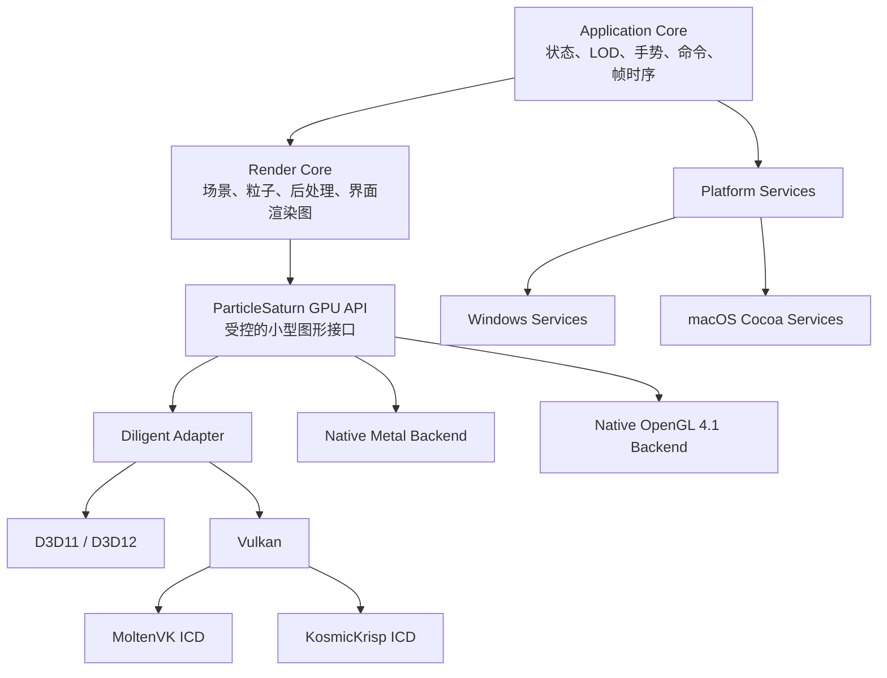

# Particle Saturn 跨平台改造与架构重构 TODO

> 本文档基于 2026-07-16 的静态分析与只读环境核对编写。四个子模块已全部检出（`libs/DiligentCore`、`libs/imgui`、`HandTracker/libs/opencv`、`HandTracker/libs/tensorflow`），Git 工作区保持干净。阶段 0 已完成，可进行真实编译验证。

## 0. 文档约定与术语

- **Windows 原生代码保持不动**：现有 OpenGL（`src/OpenGL/`）和 Diligent（`src/Diligent/`）两套 Windows 实现的算法、接口行为和构建方式在迁移期作为回归参照，不一次性替换。
- **四模式 / 八目标**：macOS 最终提供 OpenGL 4.1、Metal、Vulkan/MoltenVK、Vulkan/KosmicKrisp 四种运行模式；Windows 保留 OpenGL、D3D11、D3D12、Vulkan 四个后端。
- **GPU API**：指项目自研的受控小型图形接口（`ParticleSaturn GPU API`），不是 Diligent 接口。
- **渲染图（RenderGraph）**：显式声明读取/写入资源的通道编排系统。
- **ABI 描述**：统一着色器接口描述文件，生成 C++/HLSL/GLSL/MSL 结构声明，保证二进制布局一致。
- 文中 `file:line` 格式引用指向当前代码位置，重构后路径会变化。

---

## 1. 当前代码库现状摘要

### 1.1 目录结构

```
src/
├── AppState.h / AppState.cpp          # 全局状态聚合（窗口、渲染、UI、手势、LOD、DWM）
├── Settings.h                         # 注册表存储（Windows 专属）
├── ErrorHandler.h                     # SEH + DbgHelp + TaskDialog（Windows 专属）
├── DebugLog.h / Localization.h / Utils.h / ShaderCache.h
├── OpenGL/                            # Windows OpenGL 4.3+ 版本（GLFW + GLAD + GLM）
│   ├── Main.cpp                       # 1983 行，强制要求 OpenGL 4.3
│   ├── Renderer.cpp / Renderer.h      # FBO、着色器编译、模糊
│   ├── ParticleSystem.cpp / .h        # 三缓冲 SSBO、粒子初始化、间接绘制
│   ├── UIManager.cpp / .h             # ImGui 界面
│   ├── WindowManager.h                # DWM 背景效果
│   ├── Shaders.h                      # 内嵌 GLSL 源码
│   └── md3/                           # MD3 UI 组件
├── Diligent/                          # Diligent D3D11/D3D12/Vulkan 版本（纯 Windows）
│   ├── Main.cpp                       # Win32 入口、消息循环
│   ├── DiligentBackend.cpp / .h       # 6221 行，设备/渲染/合成/UI/手势混合
│   ├── DirectCompositionSwapChain.cpp / .h
│   ├── VulkanD3D12Interop.cpp / .h    # Vulkan-D3D12 互操作
│   ├── ImGuiDiligent.cpp / .h         # ImGui + imgui_impl_win32
│   ├── HandTrackerController.cpp / .h # LoadLibraryW 加载 HandTracker.dll
│   ├── Win32WindowManager.cpp / .h    # DWM Mica/Acrylic
│   ├── Settings.cpp                   # 注册表读写
│   ├── RenderBackend.h                # Backend 枚举 {D3D11, D3D12, Vulkan}
│   └── md3/                           # MD3 UI 组件
├── CameraSelector/                    # D2D 摄像头选择器（Windows 专属）
│   ├── CameraEnumerator.cpp / .h
│   ├── CameraPreview.cpp / .h
│   ├── CameraSelector.cpp / .h
│   └── D2DRenderer.cpp / .h
├── shaders/
│   ├── glsl/                          # 16 个 GLSL 450 着色器（→ SPIR-V）
│   └── hlsl/                          # 18 个 HLSL 着色器（→ DXBC/DXIL，含 Mesh Shader）
└── generated/                         # ShaderBytecodes.h（编译产物）
HandTracker/                           # 手势追踪动态库
├── include/HandTracker.h              # __declspec(dllexport/import) 接口
├── CameraCapture.h / .cpp             # DirectShow + OpenCV 抽象
├── SIMDNormalize.h / .cpp             # CPUID + SSE/AVX2 归一化
├── HandTracker.cpp / HandLandmark.* / PalmDetector.*
├── models/                            # palm_detection_full.tflite + hand_landmark_full.tflite
└── libs/                              # opencv、tensorflow 子模块
libs/
├── DiligentCore/                      # 子模块，锁定提交 b7c4f03e，Metal 仅 Pro 启用
└── imgui/                             # 子模块
scripts/
├── compile_shaders.ps1                # PowerShell，DXBC/DXIL + SPIR-V，无 Metal
├── build_diligent.ps1 / build_opencv.cmd / build_tflite.cmd
├── stage_handtracker.ps1
└── imgui_md3.patch / tflite-prune.patch
```

### 1.2 硬约束清单

| 编号 | 约束 | 位置 | 影响 |
|------|------|------|------|
| C1 | OpenGL 版本强制 4.3+ | `src/OpenGL/Main.cpp:267-282` | macOS 上限 4.1，无计算着色器/SSBO |
| C2 | Diligent 目标纯 Windows | `CMakeLists.txt:209-269` | 固定 Win32 入口、DComp、D3D/DXGI/DWM 链接 |
| C3 | Metal 被显式关闭 | `CMakeLists.txt:146` `DILIGENT_NO_METAL ON` | 开源 DiligentCore 无 Metal 实现 |
| C4 | 着色器仅 DXBC/DXIL/SPIR-V | `scripts/compile_shaders.ps1` | 无 MSL/metallib 流程 |
| C5 | 设置使用注册表 | `src/Settings.h:16` | macOS 无注册表 |
| C6 | 错误处理 SEH/DbgHelp | `src/ErrorHandler.h:4-19` | macOS 需信号/NSException |
| C7 | ImGui 固定 Win32 后端 | `src/Diligent/ImGuiDiligent.cpp:180-181` | macOS 需 imgui_impl_osx |
| C8 | 动态库 __declspec + LoadLibraryW | `HandTracker/include/HandTracker.h:5-11`、`HandTrackerController.cpp:105-106` | macOS 需符号可见性/dlopen |
| C9 | SIMD 用 x86 intrinsics | `HandTracker/SIMDNormalize.cpp:8-15` | Apple Silicon 无法编译 |
| C10 | 渲染类暴露 HWND + D3D 原生资源 | `src/Diligent/DiligentBackend.h:23,146-161` | 6221 行巨型类，平台强耦合 |
| C11 | 粒子计算依赖 SSBO + 内存屏障 | `src/OpenGL/Main.cpp:848-860` | OpenGL 4.1 无 SSBO/计算着色器 |
| C12 | CI 全部 Windows | `.github/workflows/release.yml:257-259` | 无 macOS 构建/测试 |

### 1.3 粒子物理特征

`SaturnCompute_CS.glsl:54-76` 每帧围绕 Y 轴旋转粒子，无粒子间相互作用。本体粒子用统一角速度，环粒子用各自速度。这使 macOS OpenGL 4.1 可采用解析式运动或变换反馈替代计算着色器。

### 1.4 渲染流程（Diligent 版，`DiligentBackend.cpp:5177-5239`）

```
RenderClear → RenderOffscreen (Compute + Stars + Particles)
→ RenderBloom (Downsample + Kawase Blur)
→ [if enableBlur] RenderUISceneForUI → RenderUIBlur → RenderAcrylicComposite
→ BlitOffscreenToBackBuffer (D3D11 原生或 Diligent)
→ RenderSevenSegmentFPS
→ ImGui::Render
→ Present (VSync: 0=Off, 1=On/FIFO, -1=Adaptive/FIFO_RELAXED)
```

关键常量：`MAX_PARTICLES = 1,200,000`，`MIN_PARTICLES = 200,000`，`STAR_COUNT = 50,000`，三缓冲 `kParticleBufferCount = 3`。

---

## 2. 最终目标矩阵

| 平台 | 图形接口 | 实现路径 | 着色器 |
|------|----------|----------|--------|
| Windows | OpenGL 4.3+ | 保留现有 `src/OpenGL/` | GLSL 450（内嵌） |
| Windows | D3D11 | GPU API → Diligent → D3D11 | HLSL → DXBC |
| Windows | D3D12 | GPU API → Diligent → D3D12 | HLSL → DXIL（含 Mesh Shader） |
| Windows | Vulkan | GPU API → Diligent → Vulkan | GLSL 450 → SPIR-V |
| macOS | OpenGL 4.1 | 项目原生 OpenGL 4.1 后端 | GLSL 410 |
| macOS | Vulkan / MoltenVK | GPU API → Diligent Vulkan → Loader → MoltenVK | GLSL 450 → SPIR-V |
| macOS | Vulkan / KosmicKrisp | GPU API → Diligent Vulkan → Loader → KosmicKrisp | GLSL 450 → SPIR-V |
| macOS | Metal | 项目自研 Metal 后端 → Metal | MSL → AIR → metallib |

设置枚举：

```cpp
enum class GraphicsAPI { OpenGL41, Vulkan, Metal };
enum class VulkanDriver { MoltenVK, KosmicKrisp };
```

切换后端/驱动后重启进程（与现有 `Settings::RestartWithBackend` 行为一致）。

---

## 3. 总体分层架构



依赖规则：只能由上向下。平台层不能调用渲染通道；渲染通道不能访问 `HWND`/`NSWindow`/注册表/AVFoundation；后端可访问平台原生表面句柄，但不能读取应用业务状态。

---

## 4. 建议目录结构

```
src/
├── app/
│   ├── AppController          # 输入命令 + 状态变化，不接触窗口/图形句柄
│   ├── FrameCoordinator       # 固定时间步长、手势更新、调用渲染器
│   ├── AppCommand             # 界面→控制器的命令定义
│   └── state/
│       ├── SceneState         # 时间、旋转、缩放、随机种子、粒子状态
│       ├── RenderSettings     # 粒子数、像素比例、Bloom、VSync、后端选择
│       ├── GestureSettings    # 灵敏度、轴反转、丢手延迟
│       ├── UiState            # 调试面板、模糊强度、主题、界面布局
│       └── WindowState        # 尺寸、全屏、显示器、DPI、窗口材质
├── render/
│   ├── Renderer               # 渲染入口
│   ├── RenderGraph            # 通道排序、资源生命周期、缩放重建
│   ├── ResourceRegistry       # 纹理/缓冲池、延迟释放队列
│   └── passes/
│       ├── ParticleInitPass
│       ├── ParticleSimulationPass   # 策略：Compute / TransformFeedback / Analytic
│       ├── StarfieldPass
│       ├── ParticlePass
│       ├── BloomPass                # Downsample + Kawase Blur
│       ├── SceneCompositePass       # 色调映射
│       ├── UiBlurPass               # 界面玻璃模糊
│       ├── AcrylicPass              # Acrylic 合成
│       ├── SevenSegmentPass         # 七段数码 FPS
│       └── ImGuiPass
├── gpu/
│   ├── interface/             # GpuInstance/Device/Buffer/Texture/Pipeline/...
│   ├── validation/            # 契约测试、ABI 校验
│   └── backends/
│       ├── diligent/          # DiligentAdapter → D3D11/D3D12/Vulkan
│       ├── metal/             # 自研 Metal 后端
│       └── opengl41/          # 自研 OpenGL 4.1 后端
├── platform/
│   ├── windows/               # Win32 窗口、DComp、DWM（从 src/Diligent 迁入）
│   └── macos/                 # Cocoa 窗口、NSVisualEffectView、CAMetalLayer
├── services/
│   ├── camera/                # 摄像头抽象 + 各平台实现
│   ├── hand_tracking/         # 推理核心 + 摄像头 + 设备选择 + 指令集
│   ├── settings/              # 带版本设置模型 + 平台适配器
│   ├── diagnostics/           # 崩溃捕获 + 符号化
│   └── resources/             # 资源定位（Bundle / exe 目录）
└── shaders/
    ├── abi/                   # 统一 ABI 描述 + 生成产物
    ├── hlsl/                  # D3D11/D3D12
    ├── glsl450/               # Vulkan → SPIR-V
    ├── glsl410/               # macOS OpenGL 4.1
    └── msl/                   # Metal → metallib
```

原有 `DirectCompositionSwapChain.cpp`、`VulkanD3D12Interop.cpp`、`Win32WindowManager.cpp` 进入 `platform/windows` 或 `gpu/backends/diligent/windows`，内部实现保持原样。

---

## 5. 应用核心重构

### 5.1 状态拆分

当前 `AppState.h:13-90` 将窗口、渲染、UI、手势、LOD、DWM 状态集中在一个结构中。拆分目标：

| 对象 | 职责 | 对应当前字段 |
|------|------|-------------|
| `SceneState` | 时间、旋转、缩放、随机种子、粒子状态 | `render.activeParticleCount` 中的场景部分 |
| `RenderSettings` | 粒子数、像素比例、Bloom、VSync、后端选择 | `render.*`、`ui.enableBlur` |
| `UiState` | 调试面板、模糊强度、主题、界面布局 | `ui.*` |
| `GestureSettings` | 灵敏度、轴反转、丢手延迟 | `handParams.*` |
| `WindowState` | 尺寸、全屏、显示器、DPI、窗口材质 | `window.*`、`backdrop.*` |

### 5.2 控制流

- `AppController`：只处理输入命令和状态变化，不接触 `HWND`/`NSWindow`/图形接口。
- `FrameCoordinator`：计算固定时间步长、更新手势、调用渲染器。
- 界面只能生成应用命令（如"设置粒子数""切换全屏""选择后端"），控制器更新状态，渲染器在下一帧读取状态快照。
- 消除当前界面代码直接修改 GPU 资源的问题。

### 5.3 窗口材质枚举

平台中立枚举：实色、透明、系统模糊、应用内 Acrylic。

| 枚举值 | Windows 映射 | macOS 映射 |
|--------|-------------|------------|
| Solid | DWM None | 不透明窗口 |
| Transparent | DWM 透明 | 透明 NSWindow + 透明图层 |
| SystemBlur | Mica / Acrylic | `NSVisualEffectView` |
| AppAcrylic | 应用内 Acrylic 合成 | 应用内 Acrylic 合成 |

---

## 6. 项目级图形接口（GPU API）

只覆盖 ParticleSaturn 实际需要的功能，不扩展成通用游戏引擎。

### 6.1 核心对象

| 类别 | 对象 |
|------|------|
| 设备 | `GpuInstance`、`GpuAdapter`、`GpuDevice`、`GpuCapabilities` |
| 表面 | `GpuSurface`、`FrameDrawable`、`PresentMode` |
| 资源 | `Buffer`、`Texture`、`TextureView`、`Sampler` |
| 着色器 | `ShaderModule`、`ShaderReflection` |
| 管线 | `GraphicsPipeline`、`ComputePipeline`、`MeshPipeline` |
| 绑定 | `BindingLayout`、`BindingSet` |
| 命令 | `CommandList`、`RenderEncoder`、`ComputeEncoder`、`CopyEncoder` |
| 同步 | `Fence`、`FrameToken`、`ResourceUsage` |
| 查询 | GPU 时间戳、驱动信息、内存统计 |

### 6.2 能力表

至少包含：`supportsCompute`、`supportsStorageBuffer`、`supportsIndirectDraw`、`supportsMeshShader`、`supportsTransparentSurface`、`supportsTimestamp`、`supportsProgramCache`、`supportsAdaptiveVSync`。

必需能力缺失时阻止后端启动。网格着色器等现有可选能力继续使用能力分支（当前实现见 `DiligentBackend.cpp:4904`）。

### 6.3 粒子模拟策略

决策（确认于 2026-07-16）：**变换反馈为正式路径，解析式运动为可选轻量路径**。

| 后端 | 粒子模拟实现 |
|------|-------------|
| D3D11、D3D12 | 计算着色器 |
| Vulkan / MoltenVK / KosmicKrisp | 计算着色器 |
| Metal | Metal 计算管线 |
| OpenGL 4.1（正式） | 变换反馈（Transform Feedback） |
| OpenGL 4.1（实验/可选） | 解析式运动 |

**变换反馈（正式）**：用顶点着色器更新粒子，输出到交替缓冲区。保留逐帧 GPU 模拟语义，兼容 OpenGL 4.1，每帧多一次完整粒子缓冲区读写。使用三个粒子缓冲，与现代后端保持同样的读取/写入/渲染轮转。变换反馈是 OpenGL 4.1 后端的默认实现，未来加入粒子间碰撞或重力场扰动等非恒定运动时仍可继续承载。

**解析式运动（实验/可选）**：保留初始位置和速度，在顶点着色器中根据累计时间直接计算当前位置。最终运动轨迹一致，省去模拟通道和三缓冲，内存带宽更低。手势缩放影响累积为模拟时间，暂停/恢复/速度变化保持连续。由用户在下拉菜单中切换，不作为默认路径。代码上 `ParticleSimulationPass` 对 OpenGL 4.1 后端同时提供两种实现的注册入口，不与 `supportsCompute` 能力标记耦合。

### 6.4 资源管理

- 资源通过不透明句柄管理，上层不能持有 Diligent 指针、Metal 对象或 OpenGL 名称。
- 原生句柄只允许在后端内部和受控的界面纹理桥接层出现。
- 界面纹理必须经过 `UiTextureRegistry` 分配稳定编号，MD3 和界面代码不能把 Diligent 纹理指针直接作为 `ImTextureID`。

---

## 7. 共享渲染图

### 7.1 通道序列

```
ParticleInit（仅初始化或粒子规模变化时）
    ↓
ParticleSimulation
    ↓
SceneHDR
    ├── Starfield
    └── ParticleRender
    ↓
BloomDownsample
    ↓
BloomBlur（1/6、1/12）
    ↓
SceneToneMap
    ↓
UIBackgroundBlur
    ↓
AcrylicComposite
    ↓
FinalComposite
    ↓
SevenSegment
    ↓
ImGui
    ↓
Present
```

对应当前 Diligent 版流程：`DiligentBackend.cpp:5177-5239`。

### 7.2 通道职责

每个通道声明读取资源、写入资源、格式和尺寸。渲染图负责排序、资源生命周期、缩放重建和后端资源依赖。第一阶段只做固定通道图和纹理池，暂不实现通用图编译器。

### 7.3 主要资源

| 资源 | 数量 | 说明 |
|------|------|------|
| 粒子缓冲 | 3 | 三缓冲轮转 |
| 间接绘制参数 | 1 | `DrawArraysIndirectCommand` |
| HDR 场景纹理 | 1 | 离屏渲染目标 |
| Bloom 纹理 | 4 | A/B 1/6 + C/D 1/12 |
| 界面场景纹理 | 1 | UI 场景解析 |
| 界面模糊纹理 | 4 | 1/6 强 + 1/12 弱 |
| Acrylic 纹理 | 2 | 强/弱 |
| 噪点纹理 | 1 | 全分辨率 |
| 最终后缓冲 | 1 | 呈现 |

窗口缩放时创建新尺寸资源，旧资源进入延迟释放队列，待使用它们的帧完成后销毁。

---

## 8. 自研 Metal 后端

### 8.1 子系统

```
MetalRuntime
├── MetalDevice              # 设备、命令队列、能力查询、资源创建
├── MetalSurface             # NSView + CAMetalLayer、Retina、透明合成
├── MetalFrameScheduler      # 三帧并行、信号量、临时上传缓冲
├── MetalResourceManager     # 资源生命周期、延迟释放
├── MetalPipelineLibrary     # 管线缓存、MTLBinaryArchive
├── MetalCommandContext      # 渲染/计算/复制编码器、资源依赖
├── MetalBindingManager      # 槽位绑定（第一版直接绑定，后期 Argument Buffer）
└── MetalDiagnostics         # 错误报告、驱动信息
```

### 8.2 实现要点

- 使用 metal-cpp 管理 Metal 对象。需要 Cocoa、块回调或 `CAMetalLayer` 的部分放入 Objective-C++ 文件（`.mm`），普通资源和描述结构使用标准 C++。
- `MetalSurface`：使用 Retina 物理像素设置 `drawableSize`，保持三个可绘制对象，处理窗口缩放、显示器移动、全屏和睡眠唤醒。透明模式使用 BGRA、预乘透明度和非不透明图层。系统背景模糊由 `NSVisualEffectView` 提供，项目场景模糊继续由渲染图生成。
- `MetalFrameScheduler`：三个帧上下文，每个包含命令缓冲、动态上传区、临时纹理引用和延迟释放列表。CPU 信号量限制在途帧数，Metal 完成回调归还帧上下文。每帧设置 `@autoreleasepool`。
- `MetalCommandContext`：一个命令缓冲中依次编码计算、渲染和复制工作。通过编码器边界和资源使用声明保证可见性。
- `MetalPipelineLibrary`：缓存键包含着色器哈希、颜色格式、深度格式、混合状态、采样数和设备标识。磁盘缓存采用 `MTLBinaryArchive`，加入系统版本和构建号失效控制。

### 8.3 资源存储策略

| 资源类型 | 存储模式 |
|----------|----------|
| 动态常量、ImGui 顶点、少量更新数据 | `MTLStorageModeShared` |
| 粒子状态、静态顶点、长期纹理 | `MTLStorageModePrivate` |
| 上传路径 | 共享环形缓冲 + 复制编码器 |

第一版使用 Metal 自动资源危险跟踪。完成功能一致性后再加入 `MTLHeap`、纹理别名和无跟踪资源。GPU 使用中的资源只能延迟销毁。

### 8.4 Metal 路径范围

GPU 部分需全部重写为 Metal 管线：
- 120 万粒子初始化
- 三缓冲计算模拟
- 50,000 星体
- 间接绘制
- HDR 离屏渲染
- Bloom + Kawase 模糊
- 色调映射
- 七段数码 FPS
- D3D12 网格着色器在支持的 Apple Silicon 设备上启用 Metal 对等能力，其他设备继续顶点拉取路径

Metal 着色器必须保持现有常量布局、随机算法、粒子颜色和混合公式。直接使用 MSL，不通过 SPIRV-Cross 生成，作为独立参考实现。

### 8.5 ImGui

使用官方 macOS 输入后端。渲染端先采用官方 Metal 后端，随后收进项目图形接口。

---

## 9. macOS OpenGL 4.1 后端

### 9.1 宿主

使用 Cocoa、`NSOpenGLView` 或直接管理 `NSOpenGLContext`，请求 4.1 Core Profile。独立于现有 Windows OpenGL 实现，但共享渲染通道、GPU ABI 和验收数据。

### 9.2 能力映射

| 现有能力（4.3+） | OpenGL 4.1 替代 |
|------------------|-----------------|
| 计算着色器 | 变换反馈（正式）或解析式运动（实验） |
| SSBO | 变换反馈输出缓冲 / VBO |
| 内存屏障 | `glFlush()`、变换反馈结束同步 |
| 持久映射缓冲 | 普通缓冲路径（项目已有） |
| 间接绘制 | `glDrawArraysIndirect`（4.0+ 支持） |
| HDR 帧缓冲 | `GL_R11F_G11F_B10F`（已有） |
| 程序二进制缓存 | `glProgramBinary`（4.1 支持） |

### 9.3 完整实现清单

变换反馈粒子更新（正式路径）、解析式运动（可选轻量路径，由用户切换）、间接绘制、HDR 离屏缓冲、Bloom、Kawase 模糊、色调映射、透明窗口、ImGui。

### 9.4 废弃说明

Apple 已停止扩展 OpenGL，Apple Silicon 当前仍能运行 4.1。作为完整兼容及对照路径保留，Metal 承担长期主路径。

---

## 10. Vulkan 双 ICD

### 10.1 运行时选择

macOS 入口在任何 Vulkan 调用前读取设置。选择 Vulkan 时设置 `VK_DRIVER_FILES` 指向唯一 ICD 清单，再初始化 Diligent Vulkan。切换驱动后保存设置并重启应用。两个 ICD 不允许同时枚举，也不允许失败后自动换用另一驱动。

### 10.2 应用包布局

```
ParticleSaturn.app/
└── Contents/
    ├── Frameworks/
    │   ├── libvulkan.1.dylib
    │   ├── libMoltenVK.dylib
    │   └── libvulkan_kosmickrisp.dylib
    └── Resources/vulkan/icd.d/
        ├── MoltenVK_icd.json
        └── kosmickrisp_icd.json
```

### 10.3 MoltenVK

启用 `VK_KHR_portability_enumeration`。

### 10.4 KosmicKrisp

决策（确认于 2026-07-16）：**不锁定具体提交，自由追更最新**。个人玩具项目不需要稳定性承诺。

- 完全以实际查询结果为准，不预设能力。
- 当前构建脚本最低部署版本 macOS 26.0，与开发机 macOS 26.5.2 相容。
- 2026 年 7 月仍在快速开发期，补时间戳查询、图像限制和 Vulkan 1.4 暴露。是最大不确定项。
- 驱动异常必须在自己的后端内暴露，不能自动静默切到 MoltenVK。
- Diligent 对 KosmicKrisp 的兼容修复集中在 `DiligentVulkanAdapter`，不能散布进渲染通道。

### 10.5 日志要求

日志与崩溃报告必须同时记录图形接口、ICD 名称、驱动版本和能力表。

---

## 11. 着色器体系

### 11.1 四套入口

| 后端 | 源码与产物 |
|------|-----------|
| D3D11、D3D12 | HLSL → DXBC / DXIL |
| Vulkan | GLSL 450 → SPIR-V |
| OpenGL 4.1 | GLSL 410 |
| Metal | MSL → AIR → metallib |

### 11.2 统一 GPU ABI 描述

决策（确认于 2026-07-16）：**Python 3 + Mako 模板引擎，置于 `scripts/abi/`**。

粒子结构、常量缓冲和绑定编号不能人工复制四遍。ABI 描述使用 YAML 格式，由 `scripts/abi/` 下的 Python 脚本读取，经 Mako 模板渲染生成多语言结构声明和编译时断言。

```yaml
# shaders/abi/particle.yaml
- name: ParticleData
  size: 32
  members:
    - { name: pos,    type: float4,  offset: 0  }
    - { name: color,  type: uint32,  offset: 16 }
    - { name: speed,  type: float,   offset: 20 }
    - { name: isRing, type: float,   offset: 24 }
    - { name: pad,    type: float,   offset: 28 }
```

生成产物输出到 `src/generated/`（已有目录）：

```
shaders/abi/particle.yaml
    → src/generated/ParticleAbi.generated.h       # C++ struct + static_assert
    → src/generated/ParticleAbi.generated.hlsl    # HLSL struct + cbuffer
    → src/generated/ParticleAbi.generated.glsl    # GLSL struct + layout
    → src/generated/ParticleAbi.generated.metal   # MSL struct + constant_buffer
```

ABI 工具必须生成字段尺寸、对齐和偏移断言。缓冲结构禁止使用语言相关的布尔类型，矩阵明确规定行列顺序，颜色空间和纹理坐标原点写入接口约定。

算法主体（随机算法、粒子更新公式、色调映射公式）分别实现，但通过固定输入和 GPU 读回测试验证一致性。

### 11.3 当前着色器清单

GLSL（16 个）：
`SaturnInit_CS`、`SaturnCompute_CS`、`SaturnParticle_VS/PS`、`Star_VS/PS`、`FullscreenQuad_VS/PS`、`BloomDownsample_VS/PS`、`BloomBlur_VS/PS`、`AcrylicComposite_VS/PS`、`SevenSeg_VS/PS`

HLSL（18 个，多 `SaturnParticleMesh_MS/PS`）：同上 + Mesh Shader。

macOS 需新增：
- GLSL 410 版本（全部 16 个，计算着色器改为变换反馈顶点着色器）
- MSL 版本（全部对应 Metal 管线，含 Mesh Shader 对等）

### 11.4 构建工具

当前 `compile_shaders.ps1` 仅 PowerShell + Windows 编译器。拆成平台中立的着色器构建目标：
- Windows 调用 DXC、FXC 和 glslang
- macOS 调用 glslang 与 `xcrun metal/metallib`

SPIRV-Cross 保留为开发期对照工具：把 Vulkan SPIR-V 转成 MSL，再与手写 MSL 的反射结果和画面比较。正式 Metal 包只加载手写 MSL 生成的 `metallib`。

---

## 12. 平台服务

### 12.1 服务对照表

| 服务 | Windows | macOS |
|------|---------|-------|
| 应用宿主 | Win32 消息循环（`src/Diligent/Main.cpp`） | `NSApplication`、`NSWindow` |
| 输入 | Win32（`imgui_impl_win32`） | `NSEvent`、`imgui_impl_osx` |
| 设置 | 保留注册表实现（`src/Settings.h`） | `NSUserDefaults` |
| 窗口材质 | DWM、DirectComposition | `NSVisualEffectView`、透明图层 |
| 摄像头 | DirectShow + D2D 选择器 | AVFoundation |
| 资源定位 | 可执行文件目录 | `NSBundle` |
| 动态库 | `LoadLibraryW`（`HandTrackerController.cpp:105`） | `dlopen` 或静态链接 |
| 诊断 | SEH、DbgHelp、PDB（`ErrorHandler.h`） | 信号处理、`NSException`、dSYM、`atos` |

### 12.2 设置

共享设置层定义带版本的设置模型。Windows 保留注册表实现，无需迁移。macOS 使用 `NSUserDefaults` 或 JSON（`~/Library/Application Support`）。Vulkan 驱动设置属于启动前配置，macOS 入口必须能在图形系统创建前读取。

### 12.3 摄像头

决策（确认于 2026-07-16）：**纯 AVFoundation + Accelerate/vImage，不保留 OpenCV**。macOS 构建不再需要 OpenCV 子模块（消除约 500MB+ 克隆和许可证约束）。

当前 `CameraCapture.h:14` 已定义抽象 `ICameraCapture`，Windows 用 DirectShow，其他平台走 OpenCV。macOS 新增纯 `AVCaptureSession` 实现，不使用 OpenCV：

- 权限请求（`NSCameraUsageDescription`）
- 设备唯一标识
- 摄像头占用错误
- 设备热插拔
- 预览、记住选择、主动重选

AVFoundation 直接输出 `CVPixelBuffer`，通过 Accelerate/vImage 或 NEON 转换成推理张量格式，消除 `cv::Mat` 中间拷贝和格式转换延迟。开发迭代初期可将 AVFoundation 输出与旧 OpenCV 路径逐帧比较验证正确性，但正式 `.app` 只包含 AVFoundation 实现。

摄像头选择器保留预览和记住选择功能。D2D 选择器（`src/CameraSelector/`）是 Windows 专属，macOS 需原生设备选择窗口。

模型放入应用包资源目录，通过 `NSBundle` 定位。

### 12.4 手势跟踪

拆成四层：
1. 模型推理（TensorFlow Lite，复用现有模型 `palm_detection_full.tflite` + `hand_landmark_full.tflite`）
2. 摄像头捕获（Windows DirectShow / macOS AVFoundation）
3. 设备选择（Windows D2D / macOS 原生）
4. 指令集优化（见第 13 节）

摄像头线程和推理线程只发布最新不可变手势样本，渲染线程不等待推理。

### 12.5 动态链接

决策（确认于 2026-07-16）：**macOS 使用静态链接**，Windows 保持现有 `LoadLibraryW` 不变。

当前 `HandTracker.h:5-11` 使用 `__declspec`，`HandTrackerController.cpp:105` 使用 `LoadLibraryW` + 固定路径。macOS 采用已有 `HANDTRACKER_STATIC` 编译模式（`CMakeLists.txt:274-399`），整个 HandTracker 静态链接进主程序。理由：
- 避免 `dlopen` 的 `@rpath` 配置和代码签名复杂性
- 消除卸载时仍有线程运行的竞态风险（Windows 版已因该问题注释 "Do NOT FreeLibrary"）
- LTO 可跨库边界优化图像预处理热路径
- TensorFlow Lite 已静态编译，AVFoundation 是系统框架，不存在动态分发的需求

Windows 端继续使用现有 `LoadLibraryW` + DLL 模式，不做改动。

### 12.6 诊断

macOS 使用信号处理（`SIGSEGV`/`SIGBUS`/`SIGABRT`）、`NSException` 捕获、dSYM 符号化和 `atos` 回溯。不做加固运行时、公证、开发者 ID 签名和正式安装包。

---

## 13. SIMD / 指令集调度系统

### 13.1 当前问题

`SIMDNormalize.cpp:8-15` 直接处理 CPUID、SSE、AVX2，继续增加 NEON、AVX-512 会失控。需重构为"能力检测、内核注册、自动选择、正确性验证"四层。

### 13.2 指令集范围

| 平台 | 基础路径 | 可增加的高性能路径 | 主要用途 |
|------|----------|---------------------|----------|
| Windows x64 | 标量、SSE2 | SSE4.1、AVX2+FMA、AVX-512F/BW/VL | 图像转换、归一化、浮点批处理 |
| Windows 新型 x64 | AVX2 | AVX-512 VNNI、BF16、FP16，条件合适时 AMX | 量化推理、矩阵运算 |
| Apple Silicon | ARM64 NEON | FP16、DotProd、I8MM、BF16 | 图像预处理及量化模型 |
| 未来 ARM 设备 | NEON | SVE、SVE2、SME | 可变宽向量和矩阵运算 |
| Windows ARM64 | NEON | 设备公开的 ARM 扩展 | 可复用 macOS 大部分内核 |

Apple Silicon NEON 属于 ARM64 基础能力，作为 macOS 最低实现。当前模型保持 FP32 时，强制使用 I8MM 或 BF16 不会自动产生性能收益。SVE2/SME 预留接口，不假定公开支持；利用 Apple 内部矩阵单元应通过 Accelerate/BNNS/Core ML。

### 13.3 能力模型

内部保存能力位集合，不使用单一递增枚举：

```
CpuFeatureSet
├── 架构：X86_64 / ARM64
├── 浮点：FMA / FP16 / BF16
├── 向量：SSE2 / SSE4.1 / AVX2 / AVX512 / NEON / SVE2
├── 整数矩阵：VNNI / DotProd / I8MM / AMX
└── 操作系统状态：XMM、YMM、ZMM、Tile、SME 是否允许使用
```

界面显示执行档位：自动、标量、SSE2、AVX2+FMA、AVX-512、NEON、NEON+FP16、NEON+DotProd、NEON+I8MM、系统加速库。只显示当前设备可执行的档位。用户强制选择无效档位时保留原设置并报告缺少的能力。

**现有枚举值保持不变**（`HandTrackerSIMDMode` 0-3 和 `SIMDMode` 枚举），新值追加到末尾，避免旧数值失效。

### 13.4 运行时检测

- Windows x64：同时检查 CPUID 和操作系统保存状态。AVX2 要求 CPU 能力 + `OSXSAVE` + XCR0 YMM 状态。AVX-512 还要求 ZMM 和操作掩码状态。AMX 需要操作系统允许保存 Tile 状态。
- macOS：`sysctlbyname` 查询 `hw.optional.arm.FEAT_*`。查询项不存在按不支持处理。编译期 `__ARM_NEON` 只说明源文件允许生成 NEON 指令，不替代运行设备检测。

检测结果记录到启动日志：

```
CPU: Apple M4
Architecture: arm64
Available: NEON, FP16, DotProd, I8MM, BF16
Selected preprocessing: Accelerate/vImage
Selected normalization: NEON FP32
Inference provider: TensorFlow Lite XNNPACK
```

### 13.5 按处理阶段分别调度

```
摄像头帧
  → 像素格式转换
  → 缩放和裁剪
  → 归一化
  → 通道与张量布局转换
  → TensorFlow Lite 推理
  → 手部关键点后处理
```

每阶段独立内核注册表。像素转换可能由 Accelerate/vImage 最快，归一化适合手写 NEON，TensorFlow Lite 内部由 XNNPACK 自行选择。

| 组件 | 职责 |
|------|------|
| `CpuFeatureDetector` | 检测 CPU 和操作系统实际开放的能力 |
| `KernelRegistry` | 注册各处理阶段的标量及向量实现 |
| `KernelDispatcher` | 根据能力、精度和数据规模选实现 |
| `KernelBenchmark` | 对候选内核短时间实测 |
| `AutotuneCache` | 保存设备/系统/程序版本对应的选择 |
| `KernelDiagnostics` | 输出当前选择、耗时和回退原因 |

渲染后端能力检测与 CPU 指令检测分离。

### 13.6 融合数据处理

比增加罕见指令更有价值的优化：

```
原流程：颜色转换 → 临时图像 → 缩放 → 临时图像 → 归一化 → 张量转换
融合流程：读取摄像头像素 → 缩放采样 → 颜色转换 → 归一化 → 直接写入模型张量
```

### 13.7 精度分级

| 精度等级 | 允许实现 |
|----------|----------|
| FP32 一致路径 | 标量、SSE、AVX2、AVX-512、NEON FP32 |
| 有限舍入差异 | FMA 及不同运算重排 |
| 低精度路径 | FP16、BF16 |
| 量化路径 | INT8、DotProd、I8MM、VNNI、AMX |

FP16/BF16/INT8 只有通过完整模型精度验收后才能进入自动模式。FMA 和不同向量归约顺序产生末位舍入差异，用固定容差验证。

### 13.8 构建隔离

主程序按最低架构编译，各指令变体放独立编译单元：

```
normalize_scalar.cpp
normalize_sse2.cpp
normalize_avx2.cpp
normalize_avx512.cpp
normalize_neon.cpp
normalize_neon_fp16.cpp
normalize_arm_dotprod.cpp
normalize_arm_i8mm.cpp
```

禁止对整个目标使用 `-march=native`。每个高指令文件单独设置编译参数，通过函数指针调用。高指令模块关闭跨模块内联，防止 AVX-512/I8MM 指令带入检测器或基础路径。

运行时流程：启动检测 → 选择内核 → 保存函数表 → 每帧直接调用。

### 13.9 系统库与自研内核边界

摄像头缩放、颜色转换、图像旋转优先比较 Accelerate/vImage 与自研 NEON。TensorFlow Lite 推理交给 XNNPACK。项目主要自行优化数据预处理、张量布局转换、关键点后处理。AVX-512/SVE2/SME/AMX 纳入框架能力，但只在性能分析确认值得后再增加代码。

---

## 14. 构建系统

进展（2026-07-16）：顶层 CMake 已可在非 Windows 平台构建通用应用核心和 GPU 接口测试；旧 `ParticleSaturn.Diligent` 目标继续默认仅在 Windows 启用。

### 14.1 CMake 目标

```
ParticleSaturn.Core            # 应用核心（状态、控制器、命令）
ParticleSaturn.Render          # 渲染图、通道、资源注册
ParticleSaturn.GpuApi          # 图形接口定义 + 验证
ParticleSaturn.Backend.Diligent  # Diligent 适配层（D3D11/D3D12/Vulkan）
ParticleSaturn.Backend.Metal     # 自研 Metal 后端
ParticleSaturn.Backend.OpenGL41  # 自研 OpenGL 4.1 后端
ParticleSaturn.Platform.Windows  # Win32 窗口、DComp、DWM
ParticleSaturn.Platform.macOS    # Cocoa 窗口、NSVisualEffectView
ParticleSaturn.HandTracking      # 手势追踪核心 + 平台实现
ParticleSaturn.Windows           # Windows 可执行目标
ParticleSaturn.macOS             # macOS .app 包目标
```

### 14.2 语言与架构

- 顶层工程启用 C++，仅在 Apple 平台启用 Objective-C++（`.mm`）。
- Windows 目标继续链接 D3D、DXGI、DWM 和现有 Diligent 后端。
- macOS 目标使用 `MACOSX_BUNDLE`，ARM64 架构，最小部署版本 **26.0**（与 KosmicKrisp 社区脚本一致），链接 Cocoa、Metal、QuartzCore、AVFoundation、Accelerate。

### 14.3 应用包内容

`.app` 中包含：
- 图标
- 模型（`palm_detection_full.tflite`、`hand_landmark_full.tflite`）
- `metallib`
- Vulkan Loader + MoltenVK + KosmicKrisp 动态库
- ICD JSON 清单

### 14.4 Info.plist

必须配置 `NSCameraUsageDescription`，否则系统不会授予摄像头权限。

### 14.5 签名与发布

不纳入开发者签名、加固运行时、公证和安装器。本地构建仅保持系统允许启动和访问摄像头所需的应用包结构。本地临时签名足够。CI 可以只做编译和基础测试。

### 14.6 FastRelease 配置

现有 `CMakeLists.txt:24-41` 已定义 FastRelease 配置（无 PDB、无 LTCG）。macOS 可定义类似快速迭代配置。

---

## 15. 开源依赖取舍

| 依赖 | 决策 | 理由 |
|------|------|------|
| DiligentCore | 保留 | D3D11/D3D12/Vulkan 适配，锁定提交 b7c4f03e |
| metal-cpp | 采用 | 自研 Metal 后端的 C++ 调用基础 |
| Dear ImGui macOS/Metal 后端 | 采用 | 官方支持 |
| Vulkan Loader、MoltenVK | 采用 | macOS Vulkan 路径 |
| Mesa KosmicKrisp | 采用，不锁定提交 | Vulkan→Metal 替代驱动，自由追更最新 |
| SPIRV-Cross | 仅开发期对照 | 着色器诊断，不进入正式 Metal 包 |
| LLGL、sokol_gfx | 参考设计 | 资源生命周期和接口设计参考 |
| bgfx | 不采用 | 提交模型和双 ICD 改造成本过高 |
| DiligentCorePro | 排除 | Metal 实现属商业授权，无法公开复现 |
| SDL GPU、Dawn、wgpu | 排除 | 接口范围与后端矩阵不匹配 |
| OpenCV | macOS 排除 | 纯 AVFoundation 替代，消除 500MB+ 子模块依赖 |
| TensorFlow Lite | 保留 | 启用 XNNPACK ARM64 微内核 |
| GLFW、GLAD、GLM | Windows 保留 | 现有 OpenGL 版本依赖 |

---

## 16. 迁移顺序（阶段划分）

每一步都设置可运行验收点。现有 Windows 目标在迁移期继续保留为回归参照。

### 阶段 1：建立 Windows 行为基线

- [ ] 固定随机种子、时间步长和配置
- [ ] 保存四类后端（OpenGL/D3D11/D3D12/Vulkan）截图
- [ ] 保存粒子读回数据（位置、速度、颜色、存活状态）
- [ ] 保存窗口行为和性能数据
- [ ] 记录现有快捷键行为（F3/F11/B/Esc）
- [ ] 记录现有 Bloom、模糊、Acrylic 参数

### 阶段 2：拆分应用状态、LOD、手势和界面命令

进展（2026-07-16）：已建立可独立编译测试的应用核心模块 `src/app/`，旧 Windows 渲染器保持原样，界面迁移与旧渲染器回归验证待后续通道接入时完成。

- [x] 从 `AppState.h` 拆出 `SceneState`/`RenderSettings`/`UiState`/`GestureSettings`/`WindowState`
- [x] 建立 `AppCommand` 命令定义
- [x] 建立 `AppController` 和 `FrameCoordinator`
- [ ] 界面改为生成命令，不再直接修改 GPU 资源
- [ ] 旧渲染器保持运行，验证状态拆分无回归

### 阶段 3：建立项目图形接口与 Diligent 适配层

> 此阶段**不引入 MoltenVK**。先以 Windows 三后端（D3D11/D3D12/Vulkan）建立一致性基线，避免 macOS Vulkan 栈的 portability 差异干扰 DiligentAdapter 重构。MoltenVK 和 KosmicKrisp 分别在阶段 8/9 接入，届时以已完成阶段 6 的 Metal 为 macOS 参考路径进行逐帧对比。

进展（2026-07-16）：`src/gpu/interface/` 已提供不透明资源句柄、资源状态、命令列表和设备契约；`ParticleSimulationStrategy` 已按能力表选择计算、变换反馈或解析式路径。Diligent 适配和渲染通道迁移待原生后端完成后接入。

- [x] 定义 GPU API 核心对象（设备、资源、管线、绑定、命令、同步）
- [x] 定义能力表
- [ ] 实现 `DiligentAdapter`（D3D11/D3D12/Vulkan）
- [x] 定义粒子模拟策略接口
- [ ] 按通道逐步迁移：星空 → 粒子 → Bloom → 界面模糊 → 最终合成

### 阶段 4：建立共享渲染图和 GPU ABI

进展（2026-07-16）：`RenderGraph` 会根据资源读写关系编排通道，`TexturePool` 按帧令牌延迟回收。`particle_abi.json` 通过 CMake 生成 32 字节粒子结构的 C++、HLSL、GLSL 声明并作布局断言。

- [x] 实现固定通道渲染图
- [x] 实现纹理池和延迟释放队列
- [x] 建立 ABI 描述文件和生成工具
- [x] 生成 C++/HLSL/GLSL 结构声明
- [ ] Windows 三个 Diligent 后端全部恢复一致
- [ ] 着色器构建目标平台中立化

### 阶段 5：最小 Cocoa 宿主和 Metal 表面

进展（2026-07-16）：新增 `ParticleSaturn.macOS` 应用包目标，已在本机编译。`CocoaHost` 提供窗口、Retina 可绘制尺寸和全屏切换；Metal 后端已建立设备、表面、帧调度、资源和命令上下文的基础对象。

- [x] `NSApplication` + `NSWindow` 基础宿主
- [x] `CAMetalLayer` 表面
- [x] Retina 缩放、多显示器、全屏切换
- [x] `MetalDevice`、`MetalSurface`、`MetalFrameScheduler` 基础
- [x] `MetalResourceManager`、`MetalCommandContext` 基础

### 阶段 6：Metal 渲染通道完整迁移

进展（2026-07-16）：已新增 `src/shaders/msl/ParticleKernels.metal`，包含固定种子粒子初始化、三缓冲计算模拟、HDR 色调映射、Bloom、界面 Kawase 模糊、Acrylic 合成和七段 FPS 叠加。粒子初始化采用旧 Diligent 的 PCG 序列、半径分层与四色调色板，星空采用相同的 `mt19937(1337)` 球壳数据与闪烁逻辑；相机投影、粒子顶点与片元映射和 FPS 右上角布局均已接入实际帧路径。粒子路径包含旧 Diligent 的近距离扰动、环体缩放、像素比例和密度补偿公式。Bloom 已改为旧 Diligent 的 `1/6` 分辨率亮部提取与七轮 Kawase 乒乓链，最终合成采样该链的结果，不再把 `1/12` 纹理放大到全屏；首轮亮部提取的采样步长已校正为原始场景尺寸。Bloom 半径现独立于界面模糊滑条，默认固定为旧路径值 `2.0`，调节 Acrylic 不会改变星球周边的 Bloom。色调映射已改为旧 Diligent 全屏合成的高光压缩公式，移除了未对齐的 ACES 曲线。Metal 调试面板经 `AppController` 生成粒子数量、Bloom、界面模糊、暂停和全屏命令，渲染器只读取状态快照。界面模糊现严格按旧路径先生成已色调映射的全场景纹理，再降采样至 `1/6`、执行七轮 Kawase，最后以相同的饱和度、亮度自适应、exclusion 与 tint 公式生成 Acrylic；ImGui 面板仅按其屏幕坐标采样该纹理，主场景不参与 Acrylic 合成。CMake 会在每次 MSL 变更后同步最新 `metallib` 到应用包资源目录；完整测试已通过，窗口级视觉截图待解锁当前 macOS 会话后复验。旧 MD3/ImGui 命令界面与跨路径画面基准尚未完成，因此 Metal 参考路径验收保持未完成。

- [x] 120 万粒子初始化（Metal 计算管线）
- [x] 三缓冲计算模拟
- [x] 旧 Diligent 粒子顶点/片元公式（近距离扰动、像素比例、密度补偿）
- [x] 50,000 星体
- [x] 间接绘制
- [x] HDR 离屏渲染
- [x] Bloom + Kawase 模糊
- [x] 色调映射
- [x] 界面模糊 + Acrylic 合成
- [x] 七段数码 FPS
- [x] ImGui（官方 Metal 后端）
- [x] Metal 调试面板通过 `AppController` 生成渲染和窗口命令
- [x] 透明窗口 + `NSVisualEffectView`
- [x] 管线缓存（`MTLBinaryArchive`）
- [x] MSL 着色器编写 + `metallib` 编译
- [ ] 旧 MD3/ImGui 命令界面迁入 Metal 路径
- [ ] Metal 成为 macOS 参考路径

### 阶段 7：AVFoundation、NEON、TensorFlow Lite ARM64

进展（2026-07-16）：`SIMDNormalize` 已支持 Apple Silicon 的 NEON 自动检测、显式选择和标量回退；归一化与翻转预处理均有标量一致性测试。`AVFoundationCamera` 已实现授权、唯一设备标识、连接状态、断开通知、会话采集、占用错误和 BGRA `CVPixelBuffer` 到 RGB 帧的转换。原生选择窗口已实现设备刷新、`NSUserDefaults` 记住唯一标识、主动重选和 `AVCaptureVideoPreviewLayer` 预览，并已写入 `NSCameraUsageDescription`；当前 macOS 会话处于锁屏状态，窗口与真实设备预览验收待解锁后完成。已新增 `scripts/build_tflite_macos.sh`，对锁定的 TensorFlow Lite 2.19 子模块幂等应用精简补丁并构建 ARM64 静态库，固定启用 XNNPACK、关闭哈希不稳定的可选 KleidiAI 下载。已验证 `libtensorflow-lite.a` 为 `arm64`，`libxnnpack-delegate.a` 含委托创建和释放符号，`libXNNPACK.a` 含 `xnn_initialize`。主应用尚未链接 PalmDetector/HandLandmark 推理核心，故 XNNPACK 验收项保持未完成。

- [x] `AVCaptureSession` 实现 `ICameraCapture`
- [x] 摄像头权限请求
- [x] 设备唯一标识、热插拔、占用错误
- [ ] 原生设备选择窗口（预览、记住选择、主动重选）
- [x] `CVPixelBuffer` → 推理格式转换（Accelerate/NEON）
- [x] NEON 归一化实现
- [x] SIMD 调度系统重构（能力检测、内核注册、自动选择）
- [ ] TensorFlow Lite XNNPACK ARM64 内核启用
- [x] 模型通过 `NSBundle` 定位
- [x] macOS 设置（`NSUserDefaults`）

### 阶段 8：OpenGL 4.1 变换反馈及全部后处理

进展（2026-07-16）：已增加独立的 `OpenGL41Surface`，以 `NSOpenGLProfileVersion4_1Core` 创建并呈现上下文。后端含有变换反馈、间接绘制、HDR、Bloom 和色调映射的初步代码，现有测试仅覆盖空缓冲的离屏图形调用与色调映射读回，尚未建立真实窗口、粒子初始化数据和截图验收。因此这些视觉通道保持未完成，不能作为 Metal 对照路径。

- [x] `NSOpenGLContext` + 4.1 Core Profile
- [ ] 变换反馈粒子更新（三缓冲轮转）
- [ ] 间接绘制
- [ ] HDR 离屏缓冲
- [ ] Bloom + Kawase 模糊
- [ ] 色调映射
- [ ] 透明窗口
- [ ] ImGui
- [x] GLSL 410 着色器编写

### 阶段 9：Vulkan Loader、MoltenVK、KosmicKrisp

进展（2026-07-16）：已安装并验证 MoltenVK 1.4.1、Vulkan Loader 1.4.350.1；`vulkaninfo` 成功枚举 Apple M5 Pro 和 `VK_KHR_portability_enumeration`。应用包构建会复制 Loader、MoltenVK 与 ICD，`VulkanDriverRuntime` 通过单个 ICD 设置 `VK_DRIVER_FILES`，并可按新选择启动替代进程供调用方结束当前进程。KosmicKrisp 已使用上游 Mesa 提交 `584a0997c8e4e93cfd517abe7db41c369642460a` 构建，应用包复制其动态库和经相对路径改写的 ICD；包内 ICD 已由 `vulkaninfo` 实测枚举为 `DRIVER_ID_MESA_KOSMICKRISP`。

- [x] 应用包内 Vulkan Loader + ICD 布局
- [x] `VK_DRIVER_FILES` 运行时设置
- [x] MoltenVK 接入 + `VK_KHR_portability_enumeration`
- [x] 跟随 KosmicKrisp 最新提交（不锁定）
- [x] KosmicKrisp 接入
- [ ] `DiligentVulkanAdapter` 兼容修复
- [x] 驱动切换 + 重启
- [x] 日志记录 ICD 信息

### 阶段 10：四路径一致性与性能回归

- [ ] 画面基准截图差异测试
- [ ] 粒子读回数据比较
- [ ] 窗口行为对齐
- [ ] 性能锁定测试
- [ ] 手势输入验证
- [ ] 摄像头异常状态验证
- [ ] Retina 与外接显示器
- [ ] 睡眠唤醒
- [ ] 应用包启动验证

---

## 17. 验收体系

### 17.1 后端契约测试

覆盖：缓冲上传、纹理读回、混合、sRGB、间接绘制、缩放、透明表面、GPU 同步。

### 17.2 着色器 ABI 测试

检查每个字段尺寸与绑定编号。粒子结构 32 字节布局：`pos(16) + color(4) + speed(4) + isRing(4) + pad(4)`。

### 17.3 粒子测试

固定种子 + 固定时间步长，运行指定帧数后读回采样粒子，比较位置、速度、颜色和存活状态。

### 17.4 画面测试

分别截取场景 HDR、Bloom、界面模糊和最终输出，在统一线性色彩空间比较。允许不同 GPU 的浮点舍入差异，阈值在建立基线后固定，不能针对失败后端临时放宽。

Metal 是参考路径，MoltenVK 和 KosmicKrisp 的输出分别与 Metal 对比。OpenGL 4.1 允许浮点舍入差异，但画面、粒子规模和交互语义必须一致。

### 17.5 功能验收（固定配置）

| 项目 | 要求 |
|------|------|
| 粒子数 | 1,200,000 |
| 星体数 | 50,000 |
| Bloom | 完整 |
| 界面模糊 | 两级（1/6 强 + 1/12 弱） |
| 透明合成 | 启用 |
| 手势控制 | 旋转 + 缩放 |
| 动态 LOD | 启用 |
| 调试界面 | 全部控件 |
| 快捷键 | F3、F11、B、Esc 行为对齐 |

任何后端不得通过减少粒子、跳过通道或降低纹理尺寸取得通过结果。

### 17.6 性能比较

锁定分辨率、粒子数和画质。防止用降低画质换取帧率。

### 17.7 SIMD 验证

每个向量内核与标量参考实现比较，覆盖：任意长度、非对齐地址、尾部元素、零值、极值、NaN。再运行完整摄像头到手势输出测试。自动调度测试伪造能力表，确保每种设备组合选择合法内核。实际设备测试至少覆盖：
- 一台基础 Apple Silicon
- 一台较新 Apple Silicon
- AVX2 Windows 设备
- AVX-512 Windows 设备

---

## 18. 风险与工期

### 18.1 风险排序

1. KosmicKrisp 接口变化（最大不确定项，2026 年 7 月仍在快速开发）
2. 四套着色器数值一致性
3. 透明窗口颜色与透明度合成
4. Diligent 重构后的 Windows 回归
5. AVFoundation 到 TensorFlow Lite 数据通路

### 18.2 工期估算

| 工作项 | 工程周 |
|--------|--------|
| 架构重构与 Windows 恢复 | 5-8 |
| GPU 接口和着色器 ABI | 3-5 |
| 自研 Metal 后端 | 8-12 |
| OpenGL 4.1 | 3-5 |
| 双 Vulkan ICD | 3-6 |
| 摄像头与 NEON | 2-4 |
| 一致性和性能调试 | 4-7 |
| **合计** | **24-40** |

部分工作可交叉推进。KosmicKrisp 成熟度决定最终上限。单人开发约 6-10 个月。

### 18.3 SIMD 系统工期

| 工作项 | 工程周 |
|--------|--------|
| 基础调度系统与现有 SSE/AVX 迁移 | 1-2 |
| NEON 及融合预处理 | 2-3 |
| AVX-512 和 ARM 扩展内核（按热点） | 2-4 |
| 正确性测试与自动调优 | 1-2 |

---

## 19. 关键文件索引（当前代码位置）

重构后路径会变化，以下为分析时位置：

| 功能 | 文件 | 行号 |
|------|------|------|
| OpenGL 版本检查 | `src/OpenGL/Main.cpp` | 267-282 |
| 粒子计算（SSBO 依赖） | `src/OpenGL/Main.cpp` | 846-860 |
| 粒子计算着色器 | `src/shaders/glsl/SaturnCompute_CS.glsl` | 54-76 |
| Diligent 渲染主循环 | `src/Diligent/DiligentBackend.cpp` | 4086-5239 |
| Mesh Shader 控制 | `src/Diligent/DiligentBackend.cpp` | 4904 |
| 巨型类声明 | `src/Diligent/DiligentBackend.h` | 35-366 |
| Metal 关闭 | `CMakeLists.txt` | 146 |
| Diligent 目标定义 | `CMakeLists.txt` | 209-269 |
| 链接配置 | `CMakeLists.txt` | 257-269 |
| 注册表路径 | `src/Settings.h` | 16 |
| SEH/DbgHelp | `src/ErrorHandler.h` | 4-19 |
| ImGui Win32 后端 | `src/Diligent/ImGuiDiligent.cpp` | 180-181 |
| __declspec 导出 | `HandTracker/include/HandTracker.h` | 5-11 |
| LoadLibraryW | `src/Diligent/HandTrackerController.cpp` | 105-106 |
| CPUID/SSE/AVX | `HandTracker/SIMDNormalize.cpp` | 8-15 |
| 摄像头抽象 | `HandTracker/CameraCapture.h` | 14-113 |
| 全局状态 | `src/AppState.h` | 13-90 |
| Backend 枚举 | `src/Diligent/RenderBackend.h` | 7-11 |
| 粒子常量 | `src/OpenGL/ParticleSystem.h` | 13-15 |
| 粒子结构 | `src/OpenGL/ParticleSystem.h` | 18-24 |
| 三缓冲 | `src/OpenGL/ParticleSystem.h` | 37-60 |
| 着色器编译脚本 | `scripts/compile_shaders.ps1` | 1-445 |
| CI Windows | `.github/workflows/release.yml` | 257-259 |
| 子模块 | `.gitmodules` | 1-15 |
| DiligentCore 提交 | `CMakeLists.txt` | 102-116 |

---

## 20. 不做事项清单

明确排除的范围：

- [x] ~~DiligentCorePro 商业授权~~ — 排除
- [x] ~~bgfx 作为基础~~ — 排除
- [x] ~~SDL GPU / Dawn / wgpu~~ — 排除
- [x] ~~Windows 注册表迁移到 JSON~~ — 保留注册表
- [x] ~~开发者 ID 签名、加固运行时、公证、安装器~~ — 不纳入
- [x] ~~跟随 Mesa main 分支~~ — 放宽限制，自由追更最新提交
- [x] ~~Vulkan 双 ICD 串联或自动回退~~ — 并列选择，不自动切换
- [x] ~~对整个目标使用 `-march=native`~~ — 按变体隔离编译
- [x] ~~通过 SPIRV-Cross 生成正式 Metal 着色器~~ — 手写 MSL
- [x] ~~一次性重写替换 Windows~~ — 分阶段迁移保持可运行
